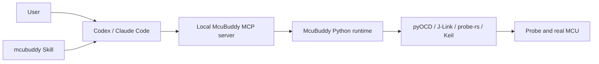
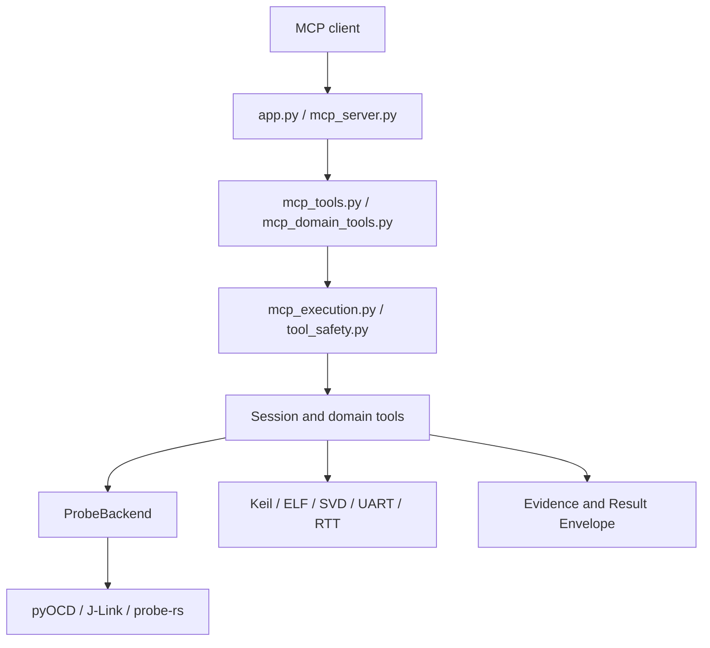

# McuBuddy Project Guide

**English** | [中文](PROJECT_GUIDE_zh.md)

> Project version: 0.6.0
>
> This is the English system-level guide to McuBuddy. When features, the CLI,
> MCP tools, architecture, or the Skill change, review and update this file and
> the [Chinese guide](PROJECT_GUIDE_zh.md) together.

<!-- guide-section:positioning -->
## 1. Project Positioning

McuBuddy is local MCU debugging and board-validation infrastructure designed for
AI clients. Through MCP, it turns debug probes, firmware symbols, build tools,
and target state into structured tools with explicit safety boundaries.

It can:

- connect to ST-Link, J-Link, CMSIS-DAP, and compatible probes;
- halt, reset, resume, and step an MCU;
- inspect registers, memory, peripherals, ELF/AXF, DWARF, and SVD data;
- collect startup, crash, peripheral, and RTOS evidence;
- build Keil projects, flash firmware, and verify Flash contents;
- extend workflows through UART, RTT, SWO, GDB, and probe-rs.

McuBuddy is not a compiler, probe driver, or complete production-line test
system. It calls those facilities and organizes them into capabilities that an
AI client can use and verify safely.

<!-- guide-section:boundaries -->
## 2. Boundaries Between McuBuddy, MCP, and the Skill

The three components have different responsibilities:

| Component | Responsibility |
| --- | --- |
| McuBuddy runtime | Connect hardware, manage sessions, execute operations, collect evidence |
| MCP server | Expose local capabilities as structured tools and enforce policies |
| `mcubuddy` Skill | Guide tool selection, risk control, and result reporting |

Installing only the Skill cannot debug hardware. The real call chain is:



The Skill is an optional workflow enhancement. An already configured MCP server
must remain usable without it.

<!-- guide-section:quickstart -->
## 3. Installation and First Connection

For normal use, install the released package once and reuse it from any local firmware project:

```powershell
python -m pip install "McuBuddy @ git+https://github.com/cunjun/McuBuddy.git"
McuBuddy doctor --json
```

The firmware project does not contain McuBuddy. The MCP client starts a dedicated local `stdio`
process, and each process owns one independent `SessionState`. There is no MCP HTTP/SSE/WebSocket
transport, shared backend service, remote hardware agent, or automatic updater. Target projects,
Keil, symbols, probes, and serial ports must be visible on the same machine. Update manually by
reinstalling from `https://github.com/cunjun/McuBuddy`.

Development setup:

```powershell
git clone https://github.com/cunjun/McuBuddy.git
cd McuBuddy
python -m venv .venv
.\.venv\Scripts\python.exe -m pip install -e ".[dev]"
```

Point the MCP client command at `McuBuddy.exe` inside that virtual environment.
Restart the client, then begin with read-only checks:

```powershell
.\.venv\Scripts\McuBuddy.exe doctor --json
.\.venv\Scripts\McuBuddy.exe config show --json
```

For a known project, resume its saved state in this order:

1. `inspect_project_memory(...)`;
2. `get_runtime_config()`;
3. `doctor()` when the environment may have changed;
4. `list_probes()` and `probe_connect(...)`;
5. `read_stopped_context()` for the first CPU snapshot.

Use `first_contact()` only for a new board, changed hardware, missing
configuration, recovery, or an explicitly requested preflight. A new AI task
alone is not a reason to discard known project state.

For a new board, run `doctor()` and `first_contact()` before
`configure_probe(...)`. Confirm the target name, backend, pack, ELF/AXF, and SVD
before connecting. On Windows, the MCP configuration should use the absolute
virtual-environment executable path and repository working directory.

RTT discovery remains bounded by `MCUBUDDY_MAX_RTT_SCAN_SIZE`; do not increase
or bypass that limit merely to make automatic scanning succeed.

To let the Skill discover the checkout before MCP is connected:

```powershell
.\.venv\Scripts\McuBuddy.exe home set E:\path\to\McuBuddy --confirm
.\.venv\Scripts\McuBuddy.exe home show --json
```

The path belongs in the user-level `.mcubuddy/installations.json` registry. It
must never be written to the repository or `SKILL.md`.

<!-- guide-section:architecture -->
## 4. Architecture and Call Chain



Key constraints:

- every MCP tool passes through the shared registration and execution boundary;
- `SessionToolRegistrar` owns confirmation, serialization, and worker isolation;
- `tool_safety.py` is the source of truth for safety levels and execution modes;
- backend differences stay behind `ProbeBackend`;
- reports separate evidence, interpretation, missing evidence, and the next safe check.

See [Architecture](docs/architecture.md) for implementation details.

<!-- guide-section:repository -->
## 5. Repository Structure

```text
McuBuddy/
├── src/McuBuddy/             Python package, MCP server, and debug capabilities
├── rust/probe-sidecar/       probe-rs sidecar
├── skills/mcubuddy/          compact, independently installable AI Skill
├── tests/unit/               unit and contract tests
├── tests/integration/        cross-module workflow tests
├── scripts/                  documentation and hardware smoke scripts
├── docs/                     architecture, tools, support, and release records
├── README.md                 English quick entry
├── README_zh.md              Chinese quick entry
├── PROJECT_GUIDE.md          English system guide
└── PROJECT_GUIDE_zh.md       Chinese system guide
```

Core files:

| File | Role |
| --- | --- |
| `src/McuBuddy/app.py` | MCP application entry |
| `src/McuBuddy/mcp_server.py` | Server creation and startup |
| `src/McuBuddy/mcp_tools.py` | Base tool registration |
| `src/McuBuddy/mcp_domain_tools.py` | Domain tool registration |
| `src/McuBuddy/mcp_execution.py` | Session execution boundary |
| `src/McuBuddy/tool_safety.py` | Safety policy registry |
| `src/McuBuddy/tool_profiles.py` | `core` plus explicit domain toolsets |
| `src/McuBuddy/session.py` | Debug session |
| `src/McuBuddy/backends/` | Probe backend adapters |
| `src/McuBuddy/result.py` | Shared result envelope |

<!-- guide-section:workflows -->
## 6. Common Debugging Workflows

### Startup Failure or HardFault

1. Confirm firmware identity and target MCU.
2. Reset and halt.
3. Collect startup or crash evidence.
4. Load ELF/AXF data and inspect symbols, stack frames, and source locations.
5. Test the hypothesis with the smallest reversible check.

### Peripheral Has No Output

1. Confirm that the command reached the firmware.
2. Confirm the intended firmware and command path.
3. Inspect RCC, GPIO, pin multiplexing, and peripheral registers.
4. Check interrupts, DMA, timers, and enable or direction signals.
5. Only then run a short, low-energy output test.
6. Observe the physical output and restore the target to a safe state.

An ACK proves only that a command was accepted; it does not prove current,
voltage, motion, or other physical output.

### FreeRTOS Stall

Collect the RTOS overview first, then inspect the named task's state, stack,
wait object, and current context.

### Keil Build and Flash

Discover project → build → parse AXF → flash → verify Flash → reset/halt →
collect evidence again. Host tests, Keil compilation, and real-board validation
are different evidence levels and must be reported separately.

<!-- guide-section:tools -->
## 7. Tool Surface and Profiles

Use `core` by default. It covers common read-only diagnosis and controlled
execution. Advanced or high-impact tools are registered only through explicit
`MCUBUDDY_TOOLSETS` selected before startup. A live MCP session cannot expand
its registered tool surface.

Exact signatures belong in the [Tool Reference](docs/tool-reference.md).
Chinese usage notes are in the
[Chinese MCP Tool Reference](docs/mcp-tools-reference-zh.md). Backend and
hardware claims belong in the [Support Matrix](docs/support-matrix.md) and
real validation records.

<!-- guide-section:safety -->
## 8. Safety and Reporting

Prefer reads. Before writing memory, changing registers, controlling execution,
or erasing Flash, confirm:

- the target MCU, board, and firmware;
- the operation's scope and purpose;
- the impact on hardware and peripherals;
- the recovery path after interruption or failure.

Use this report order:

```text
Evidence:
- ...

Interpretation:
- ...

Missing or uncertain evidence:
- ...

Next safe check and impact:
- ...
```

<!-- guide-section:development -->
## 9. Development and Extension

When adding an MCP tool:

1. implement testable logic in a domain module;
2. register safety and execution policy in `tool_safety.py`;
3. expose it through the shared registrar;
4. assign it to `default` or one explicit domain toolset;
5. update tests, the tool reference, and both project guides.

When adding a backend, implement the `ProbeBackend` contract and record actual
support boundaries. New diagnosis flows should compose atomic tools and the
shared Result Envelope without bypassing session or safety boundaries.

<!-- guide-section:verification -->
## 10. Verification System

Evidence strength, from lowest to highest:

1. source review and static contract checks;
2. unit tests;
3. integration tests;
4. real toolchain builds;
5. real probe and board validation.

Common local checks:

```powershell
.\.venv\Scripts\python.exe -m pytest
.\.venv\Scripts\python.exe -m ruff check .
.\.venv\Scripts\python.exe scripts\validate_docs.py
.\.venv\Scripts\python.exe skills\mcubuddy\scripts\validate_skill.py
```

<!-- guide-section:maintenance -->
## 11. English and Chinese Maintenance Contract

`PROJECT_GUIDE.md` and `PROJECT_GUIDE_zh.md` form one project-level document:

- neither guide has a line-count or length limit; completeness takes priority;
- both files contain the same ordered `guide-section` markers;
- the validator checks the version, core modules, profiles, safety boundaries, and links;
- changes to features, CLI, MCP tools, architecture, installation, or Skill behavior
  require both guides to be reviewed;
- translation may change phrasing, but never capabilities or validation status;
- exhaustive tool signatures remain in the tool reference instead of being copied here.

CI runs `scripts/validate_docs.py`. It fails when paired structure, version, or
critical project facts drift.

<!-- guide-section:documents -->
## 12. Reduced Documentation Map

| Need | Document |
| --- | --- |
| Quick introduction and setup | [English README](README.md) / [中文 README](README_zh.md) |
| Complete project overview | This guide / [中文项目指南](PROJECT_GUIDE_zh.md) |
| Architecture constraints | [Architecture](docs/architecture.md) |
| Exact tool signatures | [Tool Reference](docs/tool-reference.md) |
| Chinese tool usage | [Chinese MCP Tool Reference](docs/mcp-tools-reference-zh.md) |
| Verified support status | [Support Matrix](docs/support-matrix.md) |
| Version changes | [CHANGELOG](CHANGELOG.md) / `docs/releases/` |

The rule is simple: READMEs are entry points, Project Guides explain the whole
system, and separate references exist only for facts that need independent
maintenance. The Skill no longer duplicates the documentation set.

---

## 13. Consolidated Former Topic Guides

This chapter preserves the full operational material that previously lived in separate Markdown files. The files were consolidated to remove duplicate maintenance points; their information was not intentionally discarded.

<a id="quickstart"></a>

### Quickstart

This guide gets one McuBuddy MCP session from installation to its first structured hardware evidence.

## 1. Requirements

- Python 3.11+
- A supported probe and driver
- A target name accepted by the selected backend
- Optional ELF and SVD files for symbols and peripheral decoding

## 2. Install

```bash
git clone <repository-url>
cd McuBuddy
python -m venv .venv
```

Windows:

```powershell
.venv\Scripts\Activate.ps1
python -m pip install -e .
```

Linux/macOS:

```bash
source .venv/bin/activate
python -m pip install -e .
```

## 3. Validate runtime and configuration

Run the management preflight before starting an MCP client or touching hardware:

```text
McuBuddy doctor --json
McuBuddy config generate > mcubuddy.toml
McuBuddy config validate mcubuddy.toml
McuBuddy config show --json
McuBuddy probes list --json
```

For PY32F030X8, diagnose or explicitly install the trusted device pack:

```powershell
McuBuddy packs diagnose PY32F030X8 --json
McuBuddy packs install PY32F030X8 --confirm --json
```

Configuration precedence is defaults, then TOML, then `MCUBUDDY_*` environment variables, then
CLI `--set SECTION.FIELD=VALUE` overrides. Keep memory writes and flash erase disabled until a
specific workflow requires them. RTT scanning is bounded by `security.max_rtt_scan_size`; use
`MCUBUDDY_MAX_RTT_SCAN_SIZE` only to set an intentional, board-appropriate limit.

## 4. Configure the MCP client

Windows example:

```json
{
  "mcpServers": {
    "mcubuddy": {
      "command": "C:\\path\\to\\McuBuddy\\.venv\\Scripts\\McuBuddy.exe",
      "args": [],
      "cwd": "C:\\path\\to\\McuBuddy"
    }
  }
}
```

For environment variables and alternate launchers, see [Windows MCP configuration](#windows-mcp-configuration). Restart the MCP client after changing its configuration.

## 5. Choose a profile

<!-- mcubuddy-profile: core -->
The default `core` profile is sufficient for discovery, connection, read-only inspection, evidence packages, and common build/flash entry points. Begin here.
<!-- /mcubuddy-profile -->

Select the required `MCUBUDDY_TOOLSETS` before server startup when you need specialized diagnosis, smoke tests, fine-grained stepping, run-to-location, or other advanced controls.
<!-- /mcubuddy-profile -->

## 6. Discover and connect

Ask McuBuddy to resolve the backend target name if necessary:

```text
list_connected_probes()
match_chip_name(target="PY32F030")
get_target_info(target="py32f030x8")
```

Configure the backend and connect:

```text
configure_probe(backend="pyocd")
probe_connect(target="py32f030x8")
```

Use `unique_id` when multiple probes are attached. If connection is unstable, lower the SWD speed, check target power/wiring/reset, and close other debugger processes.

Inside the MCP session, inspect memory under the confirmed firmware project before runtime or
hardware preflight:

```text
inspect_project_memory(target_root="confirmed firmware project root")
get_runtime_config()
doctor()
first_contact()
```

If memory is missing, review the proposal and confirm its target root and contents before calling
`write_project_memory(...)`. Never create another firmware project's memory in the McuBuddy
repository merely because the Skill runs there.

## 7. Collect first evidence

Establish a known stopped state before interpreting registers or memory:

```text
probe_reset(halt=True)
read_stopped_context()
collect_startup_evidence()
```

For a crash:

```text
collect_crash_evidence()
backtrace()
```

Treat returned facts as evidence. Keep hypotheses separate until registers, stack, symbols, logs, or peripheral state support them.

## 8. Add symbols and SVD data

Configure an ELF used by project workflows:

```text
configure_elf(elf_path="build/firmware.elf")
```

Load it into the current debug session:

```text
elf_load(path="build/firmware.elf")
```

Load a peripheral description when clock or peripheral state matters:

```text
svd_load(svd_path="device.svd")
svd_read_peripheral(peripheral="RCC")
```

## 9. Keep session operations ordered

One McuBuddy server session is one hardware-debug channel. Await reset, halt, resume, memory access, backend configuration, build, flash, and disconnect calls. Use separate sessions for independent boards.

## 10. Next routes

- Unknown/custom board: [Generic board workflow](#generic-board-workflow)
- AI-driven diagnosis: [AI debugging playbook](#ai-debugging-playbook)
- Exact commands: [Tool reference](docs/tool-reference.md)
- Backend limits: [Support matrix](docs/support-matrix.md)
- Real-board qualification: [Board validation guide](#board-validation)

## Troubleshooting

- No tools visible: restart the MCP client and inspect server stderr.
- Probe missing: verify drivers, USB permissions, cables, and competing debugger processes.
- Target rejected: use `match_chip_name(...)` and the backend-canonical name.
- Symbols absent: confirm the ELF contains debug information and belongs to the flashed image.
- Peripheral names absent: load the correct SVD for the device family.

<a id="windows-mcp-configuration"></a>

### Windows MCP Configuration

Use generic absolute paths and adjust them to the local checkout. Do not copy another user's home or workspace path.

## Direct virtual-environment launch

```json
{
  "mcpServers": {
    "mcubuddy": {
      "command": "C:\\path\\to\\McuBuddy\\.venv\\Scripts\\McuBuddy.exe",
      "args": [],
      "cwd": "C:\\path\\to\\McuBuddy"
    }
  }
}
```

This is the preferred Windows setup because it does not depend on shell activation.

## Select domain toolsets

The default `core` profile exposes 19 stable orchestration and session tools. Add only the domains
needed by the workflow:

```json
"env": {
  "MCUBUDDY_TOOLSETS": "probe,diagnose"
}
```

Valid values are `probe`, `diagnose`, `build_flash`, `rtos`, `logs`, and `experimental`. The
`default` toolset is always present. Restart the MCP client after changing the selection.

## Enable explicit domain toolsets

The default profile is `core`. Add an environment variable only when advanced tools are required:

```json
{
  "mcpServers": {
    "mcubuddy": {
      "command": "C:\\path\\to\\McuBuddy\\.venv\\Scripts\\McuBuddy.exe",
      "args": [],
      "cwd": "C:\\path\\to\\McuBuddy",
      "env": {
        "MCUBUDDY_TOOLSETS": "probe,diagnose"
      }
    }
  }
}
```

Select only the domains needed for an expert workflow; normal installations should select
domain toolsets. An already-running server always keeps its existing tool set.

## Using a module launcher on PATH

If the intended Python environment is already stable and explicit:

```json
{
  "mcpServers": {
    "mcubuddy": {
      "command": "McuBuddy",
      "args": [],
      "cwd": "C:\\path\\to\\McuBuddy"
    }
  }
}
```

Prefer the direct virtual-environment path when multiple Python installations exist.

## Verification

From PowerShell:

```powershell
& 'C:\path\to\McuBuddy\.venv\Scripts\python.exe' -c "import McuBuddy; print('McuBuddy import OK')"
& 'C:\path\to\McuBuddy\.venv\Scripts\McuBuddy.exe' doctor --json
& 'C:\path\to\McuBuddy\.venv\Scripts\McuBuddy.exe' config show --json
```

Then restart the client and confirm that McuBuddy tools appear. A minimal hardware sequence is:

```text
doctor()
first_contact()
list_connected_probes()
configure_probe(backend="pyocd")
probe_connect(target="target-name")
read_stopped_context()
```

## Common failures

- `python` resolves to the wrong interpreter: use the absolute `.venv` executable.
- Server starts then exits: inspect MCP server stderr and verify editable installation.
- Tools do not change after setting the profile: fully restart the client/server process.
- Probe is busy: close Keil, GDB servers, vendor utilities, and other McuBuddy sessions.
- JSON path escaping fails: use doubled backslashes as shown above.

<a id="ai-debugging-playbook"></a>

### AI Debugging Playbook

Use McuBuddy as an evidence collector, not as permission to guess. Keep the board in a known state, collect the smallest decisive evidence set, and label interpretation separately.

## Decision order

1. Identify the exact target, probe, backend, firmware, and symptom.
2. Decide whether the next call is read-only, execution-changing, state-changing, or persistent.
3. Establish a known stopped state when register or memory consistency matters.
4. Start with the symptom-specific evidence package.
5. Add ELF, SVD, RTOS, or log evidence only when it can distinguish competing explanations.
6. Change execution or device state only with a clear reason.
7. Re-collect the same evidence after a fix so the comparison is meaningful.

## Resume or start a session

<!-- mcubuddy-profile: core -->
```text
inspect_project_memory(target_root="confirmed firmware project root")
get_runtime_config()
probe_connect(target="target-name")
probe_reset(halt=True)
read_stopped_context()
```

Project memory belongs under the confirmed firmware project, never the McuBuddy repository merely
because the Skill runs there. Reuse confirmed project facts, then verify last-known probe, serial,
and firmware state. If memory is missing, review the read-only proposal and confirm its root and
content before calling `write_project_memory(...)`.

Do not treat a new AI task as a new board. If required configuration is missing, the board changed,
connection recovery is needed, or a full preflight was requested, use:

```text
doctor()
first_contact()
match_chip_name(target="device marking")
configure_probe(backend="pyocd")
```

The default `core` profile covers the standard evidence-first flow.
<!-- /mcubuddy-profile -->

Enable the required `MCUBUDDY_TOOLSETS` before server startup for specialized diagnosis, board smoke tests, run-to-location, or fine source stepping. Explain why each expanded domain is needed.
<!-- /mcubuddy-profile -->

## Route by symptom

| Symptom | First evidence | Useful additions |
| --- | --- | --- |
| Board does not boot | `collect_startup_evidence(...)` | reset state, logs, then crash evidence if faulted |
| HardFault/crash | `collect_crash_evidence(...)` | `backtrace()`, matching ELF, stack memory |
| UART/SPI/I2C/GPIO silent | `collect_peripheral_evidence(...)` | SVD clock, GPIO, peripheral and NVIC state |
| RTOS stall | `collect_rtos_evidence(...)` | task list/context, logs, selected stacks |
| Intermittent corruption | crash evidence and snapshots | `diagnose,probe` adds specialized diagnosis/watchpoints |
| Clock suspicion | RCC/SVD evidence | `diagnose,probe` adds specialized clock diagnosis |
| Need path proof | stopped context and breakpoints | `probe` adds run-to/source stepping |

Do not enumerate every tool in this playbook; use the [tool reference](docs/tool-reference.md) for exact signatures.

## Evidence quality

Strong evidence is reproducible and tied to board state:

- exact backend target and probe ID
- firmware/ELF identity
- stop reason and core registers
- decoded fault status plus raw values
- symbol/source mapping from the matching ELF
- SVD register values from the exact device
- log timestamps and capture configuration
- before/after evidence collected with the same procedure

Weak evidence includes successful configuration without hardware contact, stale symbols, a lone ACK, inferred peripheral behavior, or a passing host-side test presented as board validation.

## Hypothesis loop

For each plausible cause:

```text
Hypothesis: what could explain the symptom?
Prediction: what evidence would be present if true?
Check: smallest safe tool call that distinguishes it?
Result: observed facts, including uncertainty or tool errors.
Decision: keep, reject, or refine the hypothesis.
```

Prefer checks that separate several hypotheses at once. Stop collecting when the evidence already decides the next safe action.

## Symbols and peripheral data

```text
configure_elf(elf_path="build/firmware.elf")
elf_load(path="build/firmware.elf")
svd_load(svd_path="device.svd")
```

Never trust source lines or variable locations until the ELF is known to match the flashed firmware. Never trust an SVD register interpretation until the device and revision are confirmed.

## Stateful ordering

Await all operations that share probe, backend, ELF/SVD, log, build, or runtime configuration. Cancellation may not interrupt an underlying synchronous probe call. Use separate server sessions for separate boards rather than racing commands in one session.

## Safety escalation

- Read-only: metadata, registers, memory, evidence packages, logs
- Execution-changing: reset, halt, resume, stepping, breakpoints/watchpoints
- State-changing: register and memory writes
- Persistent: erase, program, build-and-flash workflows

Confirm the exact target and intent before state-changing or persistent work. For motors, relays, heaters, or power switches, prefer breakpoints and read-only instrumentation, then short low-energy commands under safe physical conditions.

## Reporting

```text
Evidence:
- observed fact and source

Interpretation:
- what the evidence supports

Unknowns:
- missing or unreliable information

Next check:
- smallest safe discriminating action

Safety:
- state or hardware effects
```

Report tool failures as evidence gaps, not as proof that the firmware is healthy or faulty.

<a id="ai-request-examples"></a>

### AI Examples

These examples show compact evidence-first requests. Exact tool signatures live in the [tool reference](docs/tool-reference.md).

## Connect and baseline

```text
inspect_project_memory(target_root="confirmed firmware project root")
get_runtime_config()
probe_connect(target="target-name")
probe_reset(halt=True)
read_stopped_context()
```

Read or propose memory only inside the confirmed firmware project. If it is missing, explain the
proposal and call `write_project_memory(...)` only after confirmation. For first setup, changed
hardware, missing configuration, or connection recovery, run `doctor()` and `first_contact()`
before `configure_probe(...)`. A new AI task alone does not require first contact.

Expected report: probe ID, backend target, stop reason, core registers, errors, and the next missing evidence.

## Boot failure

```text
collect_startup_evidence()
```

If fault state is present:

```text
collect_crash_evidence()
backtrace()
```

Ask the AI to distinguish reset-loop evidence, invalid vectors, fault registers, and missing-symbol uncertainty.

## Crash with symbols

```text
configure_elf(elf_path="build/firmware.elf")
elf_load(path="build/firmware.elf")
collect_crash_evidence()
backtrace()
```

Confirm that the ELF matches the flashed image before accepting function names or source lines.

## Silent peripheral

```text
svd_load(svd_path="device.svd")
collect_peripheral_evidence(peripheral="USART1")
svd_read_peripheral(peripheral="RCC")
svd_read_peripheral(peripheral="GPIOA")
svd_read_peripheral(peripheral="USART1")
```

Separate clock enable, pin mux, peripheral configuration, interrupt state, bus activity, and physical output. A firmware ACK proves only that a command path responded.

## RTOS stall

```text
collect_rtos_evidence()
list_rtos_tasks()
rtos_task_context(task_name="worker")
```

Report scheduler state, blocked/runnable tasks, suspicious stacks, and whether task metadata was decoded reliably.

## RTT/UART logs

```text
read_rtt_log()
log_tail(lines=100)
```

Include capture backend, channel/port settings, timestamps when available, truncation, decode errors, and whether an empty result means silence or missing configuration.

## Full-profile path proof

Enable the required `probe` toolset before server startup, then use a deliberately chosen execution-control call:

```text
run_to_function(function="main")
run_to_source(file="app.c", line=120)
source_step()
```

State how execution was changed and re-collect stopped context afterward.

## Result envelope

McuBuddy results should be interpreted structurally rather than from a single text field. A typical response contains status, data/evidence, errors or warnings, and metadata.

```json
{
  "ok": true,
  "data": {"example": "evidence"},
  "warnings": [],
  "errors": [],
  "meta": {"tool": "example_tool"}
}
```

Rules for AI clients:

- `ok: false` means the requested operation did not complete; do not invent missing evidence.
- Warnings qualify the result and belong in the report.
- Empty data is not automatically proof of absence.
- Preserve raw register values alongside decoded interpretation.
- Keep facts, hypotheses, and proposed actions in separate sections.

## Safe flash comparison

Before persistent changes, confirm target, firmware path, and intent. After programming, compare the intended ELF/image with flash, reset/halt, and collect fresh evidence under the same conditions.

<a id="generic-board-workflow"></a>

### Generic Board Workflow

Use this route when the board is new, the MCU name is ambiguous, or no project-specific automation exists.

## 1. Resolve the target project and memory

Use the user-provided firmware root. If none was provided, discover Keil projects and ask the user
to choose when the result is not unique. Do not use the McuBuddy repository merely because it is
the current workspace.

```text
inspect_project_memory(target_root="confirmed firmware project root")
```

If memory is missing, explain the proposed Keil project, chip, build, probe, serial, and flash
fields. Keep unknown values unknown. Create memory only after confirming the root and content:

```text
write_project_memory(target_root="confirmed firmware project root", content="reviewed content", confirm=True)
```

## 2. Inventory the inputs

Start with the core runtime and session preflight:

```text
doctor()
first_contact()
```

Record:

- MCU marking and board revision
- Probe type and serial/unique ID
- Debug backend preference
- SWD/JTAG wiring, target voltage, and reset availability
- Keil project, ELF, SVD, CMSIS-Pack, and expected firmware image

Do not infer the exact target from a marketing board name alone.

## 3. Resolve the target

```text
list_connected_probes()
match_chip_name(target="your MCU marking")
get_target_info(target="backend-canonical-name")
```

For pyOCD, target names are usually lower-case. J-Link uses its own device catalogue. If metadata is missing, install or point McuBuddy at the appropriate CMSIS-Pack before connecting.

## 4. Configure the probe and connect

```text
configure_probe(backend="pyocd")
probe_connect(target="your_mcu_name", unique_id="probe-id-if-needed")
```

Connection recovery order:

1. Confirm target power, ground, SWDIO/SWCLK, and reset.
2. Close Keil, GDB servers, and other probe owners.
3. Lower the configured SWD speed.
4. Try attach-under-reset when supported.
5. Re-check the backend target name and pack support.

## 5. Establish a baseline

```text
probe_reset(halt=True)
read_stopped_context()
collect_startup_evidence()
```

Record backend, probe ID, target name, core registers, stop reason, and any transport errors. This baseline separates connection failures from firmware failures.

## 6. Add project information

Keil project:

```text
configure_keil_project(project_path="firmware.uvprojx")
```

ELF configuration and session loading:

```text
configure_elf(elf_path="build/firmware.elf")
elf_load(path="build/firmware.elf")
```

Confirm the ELF matches the flashed build before trusting symbols, source lines, or globals.

## 7. Add peripheral evidence

```text
svd_load(svd_path="device.svd")
svd_read_peripheral(peripheral="RCC")
```

Use SVD evidence for clock gates, GPIO modes, interrupt enables, and peripheral status. Verify addresses against the exact MCU revision when vendor files are uncertain.

## 8. Route by symptom

| Symptom | First evidence |
| --- | --- |
| No boot | `collect_startup_evidence(...)` |
| Fault/crash | `collect_crash_evidence(...)`, `backtrace()` |
| Silent peripheral | `collect_peripheral_evidence(...)`, SVD reads |
| RTOS stall | `collect_rtos_evidence(...)`, task context |
| No logs | RTT/UART configuration, then log reads |

Specialized diagnosis and fine execution control require the corresponding `diagnose` or `probe` toolset. Enable it only after the core evidence shows why it is needed.

## 9. Record validation

Use the [board validation guide](#board-validation). Store reproducible commands, structured result envelopes, firmware identity, and observed limitations; do not report a capability as supported from configuration alone.

## Safety

Reads are preferred first. Reset/halt/resume alter execution, register or memory writes alter state, and flash operations persist changes. Confirm target identity and intent before escalating.

<a id="board-validation"></a>

### Board Validation Guide

This guide records reproducible real-board evidence. Configuration, mocks, and host-side tests do not prove hardware support.

## Required identity

Record the board/revision, MCU marking and backend target, probe model/ID, backend version, firmware build/hash, ELF/SVD/pack identity, and wiring/power/reset assumptions.

## Validation order

### A. Discover

```text
inspect_project_memory(target_root="confirmed firmware project root")
get_runtime_config()
list_connected_probes()
get_target_info(target="target-name")
```

Project memory belongs to the confirmed firmware project. Reuse stable identity for a known board,
then verify last-known hardware values. For first setup, changed hardware, missing identity, or
connection recovery, run `doctor()`, `first_contact()`, and
`match_chip_name(target="device marking")` before continuing.

Pass: the intended probe and an unambiguous target are recorded.

### B. Connect

```text
configure_probe(backend="pyocd")
probe_connect(target="target-name")
```

Pass: transport, core identity, and probe ownership are confirmed without unexplained warnings.

### C. Control and read

```text
probe_reset(halt=True)
read_stopped_context()
```

Pass: halt/reset and stable core-register reads are repeatable. Document these execution-state changes.

### D. Symbols and source

```text
configure_elf(elf_path="build/firmware.elf")
elf_load(path="build/firmware.elf")
backtrace()
```

Pass: the ELF matches flash and produces credible symbol/source context.

### E. Peripheral, logs, and RTOS

```text
svd_load(svd_path="device.svd")
collect_peripheral_evidence(peripheral="RCC")
read_rtt_log()
collect_rtos_evidence()
```

Run only applicable capabilities. Distinguish unsupported, not configured, and empty evidence.

### F. Persistent operations

Build/flash validation requires explicit authorization and a recoverable image. Record the image, address/range, verification method, and post-flash evidence. A successful return alone does not prove programming.

## Evidence record

```json
{
  "board": "board-name/revision",
  "target": "backend-target",
  "probe": "model-and-id",
  "backend": "pyocd",
  "firmware": {"build": "id", "sha256": "..."},
  "capability": "stopped-context",
  "result": "pass",
  "commands": ["probe_reset(halt=True)", "read_stopped_context()"],
  "evidence": "artifact-or-log-reference",
  "limitations": []
}
```

Results are `pass`, `fail`, `blocked`, or `not_applicable`; do not use vague percentages.

## Support-matrix update

Update [support-matrix.md](docs/support-matrix.md) only from recorded evidence.

| Field | Meaning |
| --- | --- |
| Backend/target | Exact tested combination |
| Capability | Smallest independently proven behavior |
| Status | pass/fail/blocked/not applicable |
| Evidence | Stable artifact or validation record |
| Limits | Speed, reset mode, pack, firmware, or environment constraints |

## Failure handling

1. Preserve the raw result and transport errors.
2. Recheck power, wiring, reset, probe ownership, and target name.
3. Retry only after recording the changed condition.
4. Keep backend limitations separate from firmware defects.
5. Never turn a blocked check into a passing claim.

## Completion criteria

A board is validated only for exercised capabilities. Report identity, commands, criteria, evidence, execution/device-state changes, persistent changes, and remaining limits.

<a id="peripheral-actuator-debugging"></a>

### Peripheral and Actuator Debugging

Use this playbook when firmware acknowledges a command but a motor, relay, heater, LED, valve, or other output does not behave as expected. An ACK confirms only part of the software path.

## Four-layer evidence ladder

### 1. Firmware path

- Confirm the command handler ran.
- Inspect mode, guards, error flags, and requested output values.
- Use stopped context, symbols, logs, and breakpoints before modifying state.

Question answered: did firmware request the action?

### 2. Bus or driver transaction

- Inspect queued frames, DMA state, SPI/I2C/UART status, chip-select, and completion/error flags.
- Distinguish “API returned” from “transaction completed.”

Question answered: did the request reach the peripheral or external driver?

### 3. MCU peripheral and pin state

```text
svd_load(svd_path="device.svd")
collect_peripheral_evidence(peripheral="TIM1")
svd_read_peripheral(peripheral="RCC")
svd_read_peripheral(peripheral="GPIOA")
svd_read_peripheral(peripheral="TIM1")
```

Check clock gates, alternate-function selection, enable bits, compare values, interrupt/DMA state, and status flags.

Question answered: is the MCU configured to produce the expected signal?

### 4. Physical output and load

- Measure voltage, PWM, current, enable/fault pins, and supply rails.
- Check driver faults, interlocks, connectors, mechanics, and load conditions.

Question answered: did electrical energy reach the load safely?

## Interpretation rules

- A command ACK does not prove a pin toggled.
- A peripheral enable bit does not prove a waveform exists.
- A waveform does not prove the driver is powered or the load can move.
- Record where evidence stops; do not collapse all layers into “hardware failure.”

## Safety

Start with read-only evidence. For energized tests, use short duration, low duty/energy, a safe mechanical setup, and an accessible shutdown. Confirm target and address before writes; avoid repeated resets or flash cycles when they can activate outputs.

## Report

For each layer, state observed evidence, what it proves, what remains unknown, and the smallest safe next check.

<a id="skill-installation-and-boundaries"></a>

### mcubuddy Skill

`skills/mcubuddy/` packages McuBuddy's evidence-first operating guidance for Codex-compatible clients.

## Contents

```text
skills/mcubuddy/
├── SKILL.md
├── agents/openai.yaml
├── references/
└── scripts/
    ├── sync_references.py
    └── validate_skill.py
```

`SKILL.md` contains routing, safety, and reporting rules. References are generated snapshots of canonical documents under `docs/`.

## Canonical references

The sync script maintains nine references:

- `quickstart.md`
- `windows-mcp-config-example.md`
- `tool-reference.md`
- `support-matrix.md`
- `ai-playbook.md`
- `ai-examples.md`
- `generic-board-workflow.md`
- `board-validation-guide.md`
- `peripheral-actuator-debug-playbook.md`

Do not edit generated copies directly.

## Synchronize and validate

```bash
python skills/mcubuddy/scripts/sync_references.py
python skills/mcubuddy/scripts/sync_references.py --check
python skills/mcubuddy/scripts/validate_skill.py
python scripts/validate_docs.py
```

## Install elsewhere

Copy the complete `skills/mcubuddy` directory into the receiving Codex skills directory, then restart the client. Keep the directory structure intact.

## Maintenance rule

1. Edit the canonical document in `docs/`.
2. Run the sync script.
3. Run both validators and relevant tests.
4. Review the generated diff with the source change.

The skill explains when to use a capability; the tool reference owns exhaustive signatures and the support matrix owns verified compatibility claims.

<a id="tool-surface-evaluation"></a>

### GPT-5.6 Tool-Surface Evaluation

This document defines the repeatable evaluation used to compare the legacy aggregate tool catalog with
the v0.5.2 `core` profile. The machine-readable scenario source is
`tests/evaluation/gpt5p6_scenarios.yaml`.

## Fields

Each scenario records the same fields:

- `id`
- `title`
- `input`
- `completion_criteria`
- `required_evidence`
- `forbidden_operations`
- `baseline.executed`
- `baseline.reason`

## Baseline Status

The initial baseline is intentionally marked as not executed because this workspace did not have
real MCU boards, probes, Keil MDK, or public firmware artifacts attached during implementation.
Mock outputs must not be counted as hardware success. A real run should update the scenario results
with the model version, active profile, task completion, required evidence, invalid tool calls,
high-risk tool calls, total calls, and failure reason when a scenario cannot complete.

## Comparison Rule

The `core` profile passes the tool-surface comparison only when it completes or clearly blocks on
the same representative flows through explicit toolsets, avoids calls to hidden tools, and reduces invalid or
high-risk tool selection. Hardware success can only be claimed when a real board path has been run
and recorded in the validation guide or validation records.
