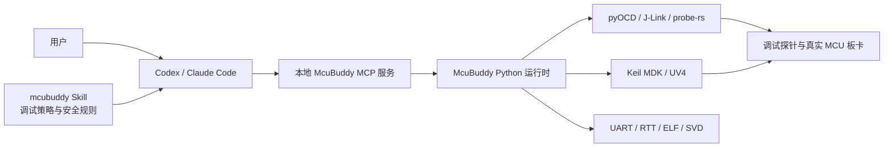
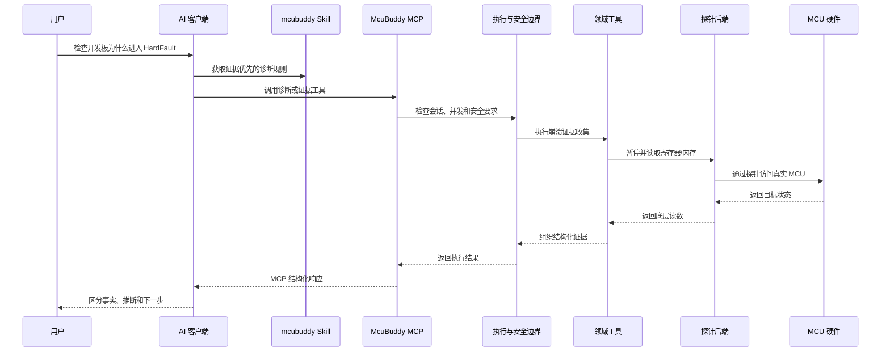

# McuBuddy 项目全景说明

[English](PROJECT_GUIDE.md) | **中文**

> 项目版本：0.6.1
>
> 本文不设行数或篇幅上限。它保留原项目全景说明，并吸收已经撤销独立文件的安装、
> 工作流、场景示例和验证规则。减少的是重复 Markdown 文件，不是项目知识。

<!-- guide-section:positioning -->
<!-- guide-section:boundaries -->
<!-- guide-section:quickstart -->
## 本地安装与连接契约

正常使用时，只需在本机安装一次发行包，然后可服务任意本地固件工程：

```powershell
python -m pip install "McuBuddy @ git+https://github.com/cunjun/McuBuddy.git"
McuBuddy doctor --json
```

固件工程无需包含、复制或 clone McuBuddy。MCP 客户端为每次连接启动独立的本地 `stdio`
进程，每个进程拥有独立的 `SessionState`。项目不提供 MCP HTTP/SSE/WebSocket 传输、共享
后台服务、远程硬件代理或自动更新器。目标工程、Keil、符号文件、探针和串口必须对运行
McuBuddy 的同一台机器可见。更新时由用户从 `https://github.com/cunjun/McuBuddy` 主动重新安装。

<!-- guide-section:architecture -->
<!-- guide-section:repository -->
<!-- guide-section:workflows -->
<!-- guide-section:tools -->
<!-- guide-section:safety -->
<!-- guide-section:development -->
<!-- guide-section:verification -->
<!-- guide-section:maintenance -->
<!-- guide-section:documents -->

> 本文是 McuBuddy 的总说明书。它从项目定位开始，沿着“整棵树 → 主干 → 树枝 → 树叶”的顺序，说明项目如何工作、各目录和模块承担什么职责，以及新用户和开发者应该从哪里开始。
>
> 具体工具参数、硬件验证状态和操作步骤仍以对应专题文档为准。本文负责建立全局认识并把分散的专题文档串联起来。

## 目录

- [1. 先说结论：McuBuddy 是什么](#1-先说结论mcubuddy-是什么)
- [2. 必须理解：Skill 不能单独进行硬件调试](#2-必须理解skill-不能单独进行硬件调试)
- [3. 一张图看懂整个系统](#3-一张图看懂整个系统)
- [4. McuBuddy 能解决什么问题](#4-mcubuddy-能解决什么问题)
- [5. 从 AI 请求到真实 MCU 的完整调用链](#5-从-ai-请求到真实-mcu-的完整调用链)
- [6. 项目架构：从主干到树枝](#6-项目架构从主干到树枝)
- [7. 仓库目录树](#7-仓库目录树)
- [8. 核心模块和重要文件](#8-核心模块和重要文件)
- [9. 五条关键业务调用链](#9-五条关键业务调用链)
- [10. McuBuddy 本体、MCP 与 Skill 的边界](#10-mcubuddy-本体mcp-与-skill-的边界)
- [11. 新用户使用路线](#11-新用户使用路线)
- [12. 开发者维护与扩展路线](#12-开发者维护与扩展路线)
- [13. 测试和验证体系](#13-测试和验证体系)
- [14. 安全模型](#14-安全模型)
- [15. 当前边界与不应混淆的概念](#15-当前边界与不应混淆的概念)
- [16. 专题文档地图](#16-专题文档地图)
- [17. 阅读路线建议](#17-阅读路线建议)

---

## 1. 先说结论：McuBuddy 是什么

McuBuddy 是一个面向 MCU 和嵌入式固件调试的本地硬件执行项目。它通过 MCP（Model Context Protocol）把调试探针、构建工具、固件符号和板卡运行状态转换为 AI 可以安全调用的结构化工具。

它的核心价值不是“告诉 AI 应该怎样调试”，而是让 AI 能够在人的授权和安全约束下真正完成这些动作：

- 发现并连接 ST-Link、J-Link、CMSIS-DAP 等调试探针；
- 暂停、复位、继续运行或单步执行 MCU；
- 读取 CPU 寄存器、故障寄存器、内存和外设寄存器；
- 使用 ELF/AXF、DWARF 和 SVD 理解符号、源码、调用栈与外设字段；
- 设置断点和观察点；
- 读取 UART、RTT 和部分 Trace 信息；
- 检查 FreeRTOS 任务和任务上下文；
- 构建 Keil 工程、下载固件并进行 Flash 校验；
- 将底层读数组织成启动、崩溃、外设和 RTOS 等诊断证据；
- 对写内存、修改寄存器、控制运行状态和擦写 Flash 等操作实施安全限制。

因此，更准确的项目定位是：

> **McuBuddy 是面向 AI 的 MCU 硬件调试与板级验证基础设施。**

它可以支撑固件开发、板卡 Bring-up、故障定位、调试自动化和板级验证，但它目前不等同于一套完整的工厂产线测试系统。

---

## 2. 必须理解：Skill 不能单独进行硬件调试

### 2.1 结论

> **不能只安装或复制 `mcubuddy` Skill 就直接调试硬件。**
>
> 要连接真实开发板，必须先将 McuBuddy 项目拉取到本地，或者把 McuBuddy Python 包安装到本地环境；然后安装依赖、配置探针和 MCP 服务，最后才能由 Codex、Claude Code 等 AI 客户端调用硬件能力。

Skill 本身不包含以下执行能力：

- 它不会启动 McuBuddy MCP 服务；
- 它不会安装 pyOCD、J-Link SDK、pyserial 或 Keil；
- 它不会加载本项目的 Python 运行时代码；
- 它不会创建或管理调试 Session；
- 它不能直接访问 USB 调试探针；
- 它不能直接读写 MCU 寄存器、内存或 Flash；
- 它不能绕过操作系统、驱动程序和物理接线去接触硬件。

Skill 只是一组面向 AI 的操作规则、调试方法、安全约束和报告规范。它告诉 AI：

- 先检查什么；
- 什么时候可以连接探针；
- 应该选择哪个证据收集流程；
- 哪些动作有风险；
- 如何区分主机测试、编译验证和真实板卡验证；
- 如何报告事实、推断和证据缺口。

真正执行操作的是本地运行的 McuBuddy 项目。

### 2.2 正确的安装关系



如果只有 Skill 而没有本地 McuBuddy 服务，调用链会在 AI 到 MCP 服务这一层中断。

### 2.3 推荐的本地准备方式

开发和维护项目时，推荐克隆仓库：

```powershell
git clone https://github.com/cunjun/McuBuddy.git
cd McuBuddy
python -m venv .venv
.\.venv\Scripts\python.exe -m pip install -e ".[dev]"
```

仅作为已发布工具使用时，可以安装 Python 包：

```powershell
python -m venv .venv
.\.venv\Scripts\python.exe -m pip install McuBuddy
```

使用 J-Link 后端时，还需要安装可选依赖和 Segger J-Link 软件：

```powershell
.\.venv\Scripts\python.exe -m pip install "McuBuddy[jlink]"
```

完成本地安装后，还要按照 [Windows MCP 配置示例](#182-windows-mcp-客户端配置) 把 McuBuddy 注册到 AI 客户端。Skill 的安装是后续增强步骤，不是 MCP 服务安装的替代品。

---

## 3. 一张图看懂整个系统

McuBuddy 可以理解为一棵树：

```mermaid
flowchart TB
    ROOT["McuBuddy<br/>MCU 硬件调试与验证项目"]

    ROOT --> USER["用户与 AI 入口"]
    ROOT --> APP["MCP 应用与工具注册"]
    ROOT --> EXEC["执行与安全边界"]
    ROOT --> DOMAIN["领域调试能力"]
    ROOT --> BACKEND["硬件与主机后端"]
    ROOT --> EVIDENCE["证据、结果与验证"]

    USER --> SKILL["mcubuddy Skill"]
    USER --> CLIENT["Codex / Claude Code"]

    APP --> SERVER["FastMCP Server"]
    APP --> TOOLS["MCP Tool Registration"]

    EXEC --> SESSION["SessionState"]
    EXEC --> SERIAL["会话内串行化"]
    EXEC --> SAFETY["安全级别与确认"]

    DOMAIN --> PROBE["探针控制与调试"]
    DOMAIN --> DIAG["故障诊断"]
    DOMAIN --> BUILD["构建与下载"]
    DOMAIN --> SYMBOL["ELF / DWARF / SVD"]
    DOMAIN --> LOG["UART / RTT / Trace"]
    DOMAIN --> RTOS["FreeRTOS"]

    BACKEND --> PYOCD["pyOCD"]
    BACKEND --> JLINK["J-Link"]
    BACKEND --> PRS["probe-rs sidecar"]
    BACKEND --> KEIL["Keil UV4"]

    EVIDENCE --> RESULT["结构化结果"]
    EVIDENCE --> RECORD["板级验证记录"]
    EVIDENCE --> TESTS["单元与集成测试"]
```



从这张图可以看到：

- Skill 位于入口侧，负责指导；
- MCP 服务和 Session 位于主干，负责协调；
- 领域工具位于中间层，负责表达调试行为；
- 后端位于硬件边界，负责真正接触探针和主机工具；
- 结果、测试和验证记录负责证明发生了什么。

---

## 4. McuBuddy 能解决什么问题

### 4.1 板卡无法启动

McuBuddy 可以暂停目标、读取 PC/LR/SP/xPSR、检查 Fault 寄存器、解析向量表和调用栈，并结合 ELF/AXF 定位到函数和源码。

### 4.2 MCU 进入 HardFault

项目提供故障分类、上下文读取、栈帧恢复、符号解析和结构化崩溃证据能力。AI 不必只看一串十六进制寄存器，而可以沿着可验证证据逐步缩小问题范围。

### 4.3 外设没有输出

可以结合 SVD 读取时钟、GPIO、UART、定时器或中断相关寄存器，判断外设是否启用、引脚是否配置以及中断是否实际触发。

### 4.4 FreeRTOS 卡顿

可以读取任务列表、任务状态、任务上下文和栈信息，辅助判断死锁、优先级问题、栈溢出或调度停滞。

### 4.5 构建、下载和验证

在 Windows 环境中，可以发现 Keil 工程和 Target，执行构建、解析日志、加载生成的 AXF，并按明确授权执行固件下载和校验。

### 4.6 调试过程缺少可靠记录

McuBuddy 将低层硬件操作包装为结构化结果，并提供板级验证记录，使“配置成功”“主机测试通过”“编译通过”和“真实开发板验证通过”不会被混为一谈。

---

## 5. 从 AI 请求到真实 MCU 的完整调用链

以下是一次典型请求的实际流向：



这条链中任何一层都不能被 Skill 单独替代：

- Skill 没有 USB 和调试器访问能力；
- AI 客户端不应该自己实现每种探针 SDK；
- 领域工具不应该直接承担 MCP 注册和安全确认；
- 后端不应该决定上层诊断策略；
- 真实板卡结果不能由主机模拟测试代替。

---

## 6. 项目架构：从主干到树枝

### 6.1 MCP 应用层

主要文件：

- `src/McuBuddy/server.py`
- `src/McuBuddy/__main__.py`
- `src/McuBuddy/cli.py`

这一层负责创建 FastMCP 应用、选择工具配置档、创建 Session，并启动服务进程。它应当保持精简，不承载具体硬件逻辑。

### 6.2 MCP 工具注册层

主要目录：

- `src/McuBuddy/mcp_tools/`

这一层把用户可见的 MCP 工具按领域注册到 FastMCP：

- `runtime.py`：配置、工具配置档、首次接入和调试循环；
- `build_debug.py`：构建、下载与 GDB Server；
- `io.py`：ELF、日志和断开流程；
- `svd.py`：SVD 外设访问；
- `diagnostics.py`：高层诊断；
- `evidence.py`：结构化证据收集；
- `probe/`：探针控制、内存、源码、符号、RTOS、Trace 和观察点。

注册层应当是薄包装：负责参数转换和 MCP 暴露，不应该包含复杂硬件算法。

### 6.3 执行与 Session 边界

主要文件：

- `src/McuBuddy/mcp_execution.py`
- `src/McuBuddy/session.py`
- `src/McuBuddy/tool_profiles.py`
- `src/McuBuddy/tool_safety.py`
- `src/McuBuddy/security_guards.py`

这一层是项目稳定性和安全性的主干：

- `SessionState` 保存当前探针、ELF、SVD、日志和配置状态；
- 同一 Session 内访问共享硬件状态的操作会串行执行；
- 阻塞式探针 SDK、构建和文件操作在工作线程中运行；
- `core` 配置档与显式 toolset 决定启动时暴露的工具面；
- 安全注册表描述工具属于只读、状态变化、写入或持久性破坏操作；
- 安全守卫对目标、地址、路径和高风险动作执行检查。

### 6.4 领域工具层

主要目录：

- `src/McuBuddy/tools/`

这一层实现与 MCP 无关的调试行为。它是“工具真正做什么”的位置，也是多数单元测试直接验证的对象。

主要领域包括：

- 探针生命周期与核心控制；
- 内存、寄存器和 Flash；
- 断点、条件断点与观察点；
- ELF、符号、变量、源码和调用栈；
- FreeRTOS 任务与上下文；
- RTT、Trace 和日志；
- HardFault、启动、时钟、中断和外设诊断；
- 工程发现、Keil 构建与下载；
- 证据收集和调试循环；
- 项目记忆与已知板卡配置。

### 6.5 后端适配层

主要目录：

- `src/McuBuddy/backends/probe/`
- `src/McuBuddy/backends/log/`
- `rust/probe-sidecar/`

后端层把统一的领域操作映射到具体技术：

- `pyocd_backend.py`：pyOCD、ST-Link 和 CMSIS-DAP 路径；
- `jlink_backend.py`：J-Link SDK 路径；
- `probe_rs_backend.py`：实验性 probe-rs 路径；
- `sidecar_client.py`：Python 与 Rust sidecar 的内部通信；
- `uart_backend.py`：串口日志。

Python 侧仍然负责 MCP、Session、诊断语义、ELF/DWARF、SVD 和 RTOS。Rust sidecar 只负责 probe-rs 硬件会话，不是第二套 MCP 服务。

### 6.6 结果与证据层

主要文件：

- `src/McuBuddy/result.py`
- `src/McuBuddy/validation_records.py`
- `src/McuBuddy/tools/evidence.py`
- `src/McuBuddy/tools/diagnostic_context.py`

这一层负责：

- 统一成功、失败、摘要、数据和建议字段；
- 把分散的寄存器、内存、日志和符号信息组织为诊断上下文；
- 记录具体板卡、探针、后端和能力的验证证据；
- 明确标注未验证、阻塞或能力不支持，而不是用猜测补齐结果。

---

## 7. 仓库目录树

```text
McuBuddy/
├── README.md                     # 英文项目入口
├── README_zh.md                  # 中文项目入口
├── PROJECT_GUIDE_zh.md           # 本文：项目全景总说明
├── CHANGELOG.md                  # 版本变更记录
├── LICENSE                       # 项目许可证
├── NOTICE                        # 上游来源与衍生项目声明
├── pyproject.toml                # Python 包、依赖、脚本和测试配置
├── server.json                   # MCP Server 注册元数据
│
├── src/McuBuddy/                 # Python 项目本体
│   ├── server.py                 # FastMCP 应用入口
│   ├── session.py                # 调试 Session 状态
│   ├── mcp_execution.py          # MCP 执行、线程和串行化边界
│   ├── tool_profiles.py          # core/toolset 工具配置
│   ├── tool_safety.py            # 工具安全分类
│   ├── security_guards.py        # 输入与危险操作守卫
│   ├── mcp_tools/                # MCP 工具注册层
│   ├── tools/                    # 领域调试逻辑
│   ├── backends/                 # 探针和日志后端
│   ├── models/                   # 结构化数据模型
│   ├── validation/               # 内置硬件验证记录
│   └── demo/                     # 无真实硬件的演示实现
│
├── skills/mcubuddy/              # AI 调试方法与安全规则
│   ├── SKILL.md                  # Skill 入口与路由规则
│   ├── agents/openai.yaml        # Skill 元数据
│   ├── references/               # 从 docs 同步的参考快照
│   └── scripts/                  # 安装、同步和校验脚本
│
├── rust/probe-sidecar/           # 实验性 probe-rs 执行边车
│   ├── src/
│   └── tests/
│
├── tests/
│   ├── unit/                     # 单模块和契约测试
│   ├── integration/              # 跨层工作流测试
│   └── evaluation/               # AI 工具面评估场景
│
├── docs/                         # 专题文档
│   ├── README.md                 # 文档导航与内容归属规则
│   ├── quickstart.md             # 安装和首次连接
│   ├── architecture.md           # 架构约束
│   ├── tool-reference.md         # 完整工具参数
│   ├── support-matrix.md         # 后端与硬件验证状态
│   ├── ai-playbook.md            # AI 调试方法
│   ├── generic-board-workflow.md # 通用板卡接入流程
│   └── board-validation-guide.md # 正式板级验证规则
│
└── scripts/                      # 项目维护和文档校验脚本
```

---

## 8. 核心模块和重要文件

| 模块 | 主要职责 | 典型输入 | 典型输出 |
| --- | --- | --- | --- |
| `server.py` | 创建并启动 MCP 服务 | Session、工具配置档 | FastMCP 应用 |
| `session.py` | 保存一次调试会话的共享状态 | 探针与运行配置 | `SessionState` |
| `mcp_execution.py` | 包装 MCP 调用、隔离阻塞操作、串行化 Session | 工具回调 | 安全执行结果 |
| `tool_profiles.py` | 控制 `core` 与显式 toolset 工具面 | 环境变量或启动参数 | 固定工具集合 |
| `tool_safety.py` | 描述工具的安全等级和执行类型 | 工具名 | 机器可读安全元数据 |
| `security_guards.py` | 检查地址、路径和危险输入 | 用户参数 | 允许或拒绝 |
| `mcp_tools/` | 对 AI 暴露 MCP 工具 | MCP 参数 | 领域工具调用 |
| `tools/` | 实现具体调试行为 | Session 与领域参数 | 结构化领域结果 |
| `backends/probe/` | 适配具体探针 SDK | 统一探针操作 | 目标硬件读数 |
| `elf_manager.py` | 管理 ELF/AXF 与符号信息 | ELF/AXF 文件 | 符号、源码和 DWARF 数据 |
| `svd_manager.py` | 管理 SVD 外设描述 | 芯片与 SVD | 寄存器和字段语义 |
| `build_runtime.py` | 管理构建工具运行环境 | 工程与工具配置 | 构建执行上下文 |
| `validation_records.py` | 管理硬件验证记录 | 板卡验证数据 | 可追踪能力证据 |
| `skill_installer.py` | 安装 Skill 文件 | 目标客户端与路径 | Skill 目录副本 |

### 8.1 为什么注册层和领域层要分开

如果所有硬件逻辑都直接写进 MCP 注册函数，会产生三个问题：

1. 无法脱离 MCP 对核心逻辑进行快速单元测试；
2. 参数转换、会话控制和硬件行为会纠缠在一起；
3. CLI、演示环境或未来其他协议无法复用领域能力。

因此，注册层只负责“怎样暴露”，领域层负责“具体做什么”。

### 8.2 为什么所有工具必须经过执行边界

探针 SDK、串口、Keil 和 sidecar 都可能阻塞。更重要的是，同一块板卡上的暂停、读取、复位、断开和切换后端不能无序并发。

执行边界保证：

- MCP 事件循环不被同步 SDK 长时间阻塞；
- 同一 Session 的共享硬件操作按顺序执行；
- 取消请求不会过早释放 Session 锁；
- 第二个命令不会在第一个 SDK 调用仍运行时替换或断开后端。

---

## 9. 五条关键业务调用链

### 9.1 服务启动

```text
McuBuddy 命令
  → server.main()
  → 创建 SessionState
  → 解析 core/toolset 工具配置
  → create_server()
  → register_all_tools()
  → SessionToolRegistrar 包装工具
  → FastMCP 启动
```

### 9.2 连接探针

```text
list_connected_probes
  → MCP 注册层
  → 探针领域工具
  → 当前 ProbeBackend
  → pyOCD / J-Link / probe-rs
  → USB 调试探针
  → 目标 MCU
```

连接前至少需要确认：

- 使用哪种后端；
- 目标芯片名称；
- 探针是否被操作系统识别；
- 目标板是否供电；
- 调试线序和复位方式是否正确。

### 9.3 HardFault 诊断

```text
崩溃症状
  → diagnose 或 collect_crash_evidence
  → 暂停并读取稳定上下文
  → CPU/Fault 寄存器
  → 栈帧与内存
  → ELF/DWARF 符号解析
  → 故障分类
  → 结构化证据与下一步
```

### 9.4 Keil 构建与下载

```text
发现工程
  → 选择 .uvprojx 与 Target
  → 配置 Keil UV4 路径
  → 执行构建
  → 解析构建日志
  → 找到 AXF
  → 加载符号
  → 经确认后下载
  → Flash/版本/运行行为验证
```

构建成功只证明工程成功生成固件，不等于板卡功能已经验证。

### 9.5 板级验证

```text
明确板卡身份
  → 发现探针
  → 连接
  → 控制与只读检查
  → 符号和源码检查
  → 外设、日志与 RTOS 检查
  → 经授权执行持久性操作
  → 保存验证记录
  → 更新支持矩阵
```

---

## 10. McuBuddy 本体、MCP 与 Skill 的边界

| 组件 | 它是什么 | 它负责什么 | 它不能替代什么 |
| --- | --- | --- | --- |
| McuBuddy 项目本体 | 本地 Python/Rust 硬件执行项目 | Session、工具、后端、诊断、结果和安全 | AI 的自然语言理解 |
| McuBuddy MCP 服务 | 本体对 AI 暴露的运行时接口 | 接收工具调用并返回结构化结果 | 项目源码、SDK 和硬件驱动 |
| `mcubuddy` Skill | AI 的调试操作指南 | 路由、证据顺序、安全和报告方式 | MCP 服务与硬件执行 |
| Codex/Claude Code | AI 客户端 | 理解目标、调用工具、解释证据 | 探针 SDK 和物理硬件 |
| 探针后端 | 硬件适配器 | 把统一操作映射到具体 SDK | 上层诊断策略 |
| Keil/pyOCD/J-Link | 外部开发与调试工具 | 构建、连接、下载和底层访问 | McuBuddy 的统一会话与证据组织 |

### 10.1 只有 Skill 时

可以获得：

- 调试流程建议；
- 安全提醒；
- 报告格式；
- 现有工具的使用说明快照。

不能获得：

- 可调用的 McuBuddy MCP 工具；
- 对开发板的真实连接；
- 寄存器和内存读取；
- Keil 构建执行；
- Flash 下载和验证。

### 10.2 只有 McuBuddy MCP 服务时

可以连接和操作硬件，但 AI 可能把工具当作无序命令列表使用，缺少统一的证据顺序、安全策略和报告规范。

### 10.3 推荐组合

> **本地 McuBuddy 项目或 Python 包 + 正确配置的 MCP 服务 + `mcubuddy` Skill + 真实探针和开发板。**

这四部分组合后，AI 才同时具备“知道怎么调试”和“能够实际调试”的条件。

---

## 11. 新用户使用路线

### 第一步：准备本地执行环境

1. 拉取 McuBuddy 项目到本地，或安装已发布的 Python 包；
2. 创建独立 Python 虚拟环境；
3. 安装基础依赖；
4. 根据探针选择 pyOCD、J-Link 或实验性 probe-rs；
5. 如果需要 Keil 工作流，在 Windows 安装 Keil MDK。

### 第二步：准备真实硬件

1. 给开发板正确供电；
2. 连接 SWD/JTAG 和必要的复位线；
3. 确认探针驱动和序列号；
4. 确认目标芯片准确型号；
5. 准备带调试信息的 ELF/AXF；
6. 如需外设语义，准备正确的 SVD 或 CMSIS-Pack。

### 第三步：配置 MCP

按照 [Windows MCP 配置示例](#182-windows-mcp-客户端配置) 注册 McuBuddy 服务，并重新启动 AI 客户端。

### 第四步：安装 Skill

Skill 是推荐增强项。它应在 MCP 服务能够正常启动之后安装。

从仓库安装到 Codex：

```powershell
python .\skills\mcubuddy\scripts\install_skill.py --target codex --overwrite
```

安装后重启客户端。请再次注意：这条命令只复制 Skill，不安装或注册 McuBuddy MCP 服务。

### 第五步：先做只读检查

推荐顺序：

1. 检查运行环境；
2. 列出已连接探针；
3. 匹配目标芯片；
4. 配置后端；
5. 连接目标；
6. 暂停并读取稳定上下文；
7. 加载 ELF/AXF；
8. 再进入具体问题诊断。

### 第六步：逐级扩大操作范围

优先级建议：

```text
元数据与发现
  → 只读寄存器/内存
  → 暂停与复位
  → 断点与观察点
  → 内存/寄存器写入
  → Flash 擦写和固件下载
```

越靠后，越需要明确目标、影响范围和恢复方式。

---

## 12. 开发者维护与扩展路线

### 12.1 新增 MCP 工具

推荐步骤：

1. 确认功能应属于哪个领域；
2. 在 `src/McuBuddy/tools/` 实现领域行为；
3. 为领域行为添加单元测试；
4. 在 `src/McuBuddy/mcp_tools/` 添加薄注册包装；
5. 在 `tool_safety.py` 注册安全等级；
6. 决定工具属于 `default` 还是一个显式领域 toolset；
7. 添加 MCP 契约或集成测试；
8. 更新工具参考和相关文档；
9. 必要时进行真实板卡验证。

不要绕过 `mcp_execution.py` 创建第二条工具执行路径。

### 12.2 新增探针后端

推荐步骤：

1. 实现统一的 ProbeBackend 能力；
2. 明确后端支持的 capability；
3. 在 `session.py` 增加后端创建路径；
4. 为无硬件路径添加测试替身和契约测试；
5. 验证连接、控制、内存、断点、Flash 等最小能力；
6. 记录不支持和部分支持的能力；
7. 使用真实板卡更新验证记录和支持矩阵。

### 12.3 新增诊断能力

诊断逻辑应优先组合已有证据工具，而不是重复实现底层寄存器读取。

每个诊断流程应说明：

- 它针对什么症状；
- 依赖哪些前置状态；
- 读取哪些证据；
- 哪些结果是事实；
- 哪些结论是推断；
- 失败时还缺什么证据；
- 是否会改变目标运行状态。

### 12.4 更新 Skill

Skill 中的参考资料是从 `docs/` 同步生成的快照，不能直接修改生成副本。

正确流程：

1. 修改 `docs/` 下的权威文档；
2. 运行 `skills/mcubuddy/scripts/sync_references.py`；
3. 运行同步检查和 Skill 校验；
4. 运行文档契约测试；
5. 检查生成差异。

### 12.5 更新本总说明文档

当以下边界变化时，应更新本文：

- 项目定位发生变化；
- 新增顶层架构层；
- 新增主要目录或独立运行时；
- Skill 与 MCP 的安装关系发生变化；
- 新增正式支持的硬件后端；
- 测试或验证体系发生结构性变化。

具体工具签名变化不应全部复制到本文，应更新 [Tool Reference](docs/tool-reference.md)。

---

## 13. 测试和验证体系

McuBuddy 的验证分为多个证据层。不同层不能互相冒充。

### 13.1 单元测试

位置：

- `tests/unit/`

用于验证：

- 纯逻辑；
- 参数和返回契约；
- 安全守卫；
- 工具配置档；
- 后端适配行为；
- 文档和 Skill 同步规则；
- 使用测试替身的硬件交互边界。

单元测试通过不等于真实探针和板卡通过。

### 13.2 集成测试

位置：

- `tests/integration/`

用于验证：

- 多模块组合；
- 配置和工具注册；
- 调试循环；
- 证据工作流；
- 构建工具；
- 项目与工具配置档契约。

集成测试仍可能使用模拟对象，因此也不能自动等同于真实硬件验证。

### 13.3 文档和 Skill 契约

相关测试包括：

- 文档链接和内容契约；
- Tool Reference 与实际工具面的同步；
- Skill 参考资料同步；
- Skill 目录结构和元数据校验；
- `core`/toolset 工具名称契约。

### 13.4 构建验证

Keil 或其他构建工具成功，证明的是：

- 工程配置可用；
- 源码能够编译和链接；
- 输出固件已经生成。

它不证明：

- 固件已正确下载；
- MCU 已启动；
- 外设行为符合预期；
- 硬件时序和电气行为正确。

### 13.5 真实板卡验证

真实板卡验证必须记录：

- 精确板卡和芯片；
- 固件版本或构建产物；
- 探针类型和序列号；
- 使用的后端；
- 实际调用；
- 原始关键结果；
- 通过、失败或阻塞状态；
- 已知限制和恢复方式。

正式流程见 [Board Validation Guide](#186-板级验证记录)，当前支持情况见 [Support Matrix](docs/support-matrix.md)。

### 13.6 推荐的证据强度顺序

```text
源码审查
  < 单元测试
  < 集成测试
  < 工具链真实构建
  < 探针连接与只读检查
  < 真实板卡功能验证
  < 多板卡/多后端重复验证
```

这个顺序并不表示低层证据没有价值，而是提醒报告者准确描述自己实际完成了哪一层验证。

---

## 14. 安全模型

硬件调试不是普通的无副作用查询。错误的写操作可能导致固件损坏、设备失控、执行器动作或 Flash 数据丢失。

### 14.1 操作等级

| 等级 | 典型操作 | 主要风险 |
| --- | --- | --- |
| 发现与只读 | 枚举探针、目标匹配、读寄存器、读内存 | 低，但读取某些外设寄存器也可能有副作用 |
| 执行状态变化 | halt、resume、reset、step | 改变实时系统行为 |
| 临时状态写入 | 写寄存器、写 RAM、断点、观察点 | 改变运行数据和时序 |
| 持久性操作 | Flash erase/program、Keil 下载 | 可能覆盖固件和持久数据 |
| 主机进程控制 | Keil 构建、GDB Server 启停 | 影响本机进程和文件 |

### 14.2 人仍然负责什么

即使使用 Skill 和 AI，以下决定仍应由人负责：

- 确认目标板和芯片；
- 确认接线与供电；
- 判断设备动作是否会带来人身或设备风险；
- 授权复位、写内存、写寄存器和 Flash 操作；
- 准备恢复固件和断电手段；
- 判断测试环境是否允许电机、继电器、电源开关等执行器动作。

### 14.3 AI 应该怎样报告

报告至少要区分：

- **已观察事实**：工具实际返回的寄存器、内存、日志和状态；
- **解释或推断**：根据事实形成的判断；
- **证据缺口**：没有读取成功或尚未验证的部分；
- **发生的状态变化**：暂停、复位、写入、下载等；
- **恢复方式**：如何回到测试前状态。

---

## 15. 当前边界与不应混淆的概念

### 15.1 McuBuddy 不是纯 Skill

Skill 是说明层，McuBuddy 是执行层。把整个项目改成纯 Skill 会失去最核心的硬件连接、Session、安全和后端能力。

### 15.2 McuBuddy 不是 Keil 的替代品

McuBuddy 可以调用 Keil 工作流并组织结果，但不重新实现 Keil 编译器、链接器和芯片支持包。

### 15.3 McuBuddy 不是探针驱动

它通过 pyOCD、J-Link SDK 或 probe-rs 访问探针。操作系统驱动和厂商工具仍需正确安装。

### 15.4 McuBuddy 不是万能产线测试系统

完整产测通常还需要：

- 治具和工位管理；
- 程控电源、万用表、示波器等仪器；
- 批次、序列号和条码；
- 用例编排和判定阈值；
- 报表、追溯和 MES；
- 操作员权限和设备校准。

McuBuddy 可以作为 MCU 调试和板级验证底座，将来在其上增加板型配置、测试用例和报告层，但这些能力不应只写进 Skill。

### 15.5 自动测试不等于真实硬件验证

模拟后端和主机测试适合快速回归接口与逻辑；涉及探针兼容性、复位行为、Flash、RTT、SWO、RTOS 或外设时序时，仍需要真实开发板证据。

---

## 16. 专题文档地图

| 想解决的问题 | 应阅读的文档 |
| --- | --- |
| 第一次认识项目 | [中文 README](README_zh.md) |
| 查看全部文档入口 | [Documentation Index](#16-专题文档地图) |
| 本地安装和首次连接 | [Quickstart](#181-安装管理命令与首次只读证据) |
| 配置 Windows MCP 客户端 | [Windows MCP Configuration](#182-windows-mcp-客户端配置) |
| 理解代码架构约束 | [Architecture](docs/architecture.md) |
| 查询工具参数和返回值 | [Tool Reference](docs/tool-reference.md) |
| 查询中文 MCP 工具参考 | [MCP Tools Reference 中文版](docs/mcp-tools-reference-zh.md) |
| 查询后端和硬件支持状态 | [Support Matrix](docs/support-matrix.md) |
| 学习 AI 调试顺序 | [AI Debugging Playbook](#183-ai-证据优先调试-playbook) |
| 查看 AI 调用示例 | [AI Examples](#184-可直接交给-ai-的场景请求) |
| 接入一块新开发板 | [Generic Board Workflow](#185-新板卡接入流程) |
| 正式记录硬件验证 | [Board Validation Guide](#186-板级验证记录) |
| 调试电机、继电器等执行器 | [Peripheral and Actuator Playbook](#187-执行器与外设的证据阶梯) |
| 维护或安装 Skill | [mcubuddy Skill](#188-mcubuddy-skill-的独立安装与边界) |
| 查看版本变化 | [CHANGELOG](CHANGELOG.md) |

### 文档内容归属原则

- 根目录 README：项目简介和快速入口；
- `PROJECT_GUIDE_zh.md`：全局结构、边界和阅读地图；
- `docs/architecture.md`：代码架构约束；
- `docs/tool-reference.md`：完整工具签名；
- `docs/support-matrix.md`：经过验证的兼容性；
- `docs/` 其他文件：具体任务和操作流程；
- `skills/mcubuddy/references/`：自动同步的 Skill 参考快照，不直接编辑。

---

## 17. 阅读路线建议

### 只想使用 McuBuddy

```text
本文第 1～5 节
  → Quickstart
  → Windows MCP Configuration
  → Generic Board Workflow
  → AI Debugging Playbook
```

### 想了解 Skill 为什么不能单独调试硬件

```text
本文第 2 节
  → 第 5 节完整调用链
  → 第 10 节组件边界
  → docs/mcubuddy-skill.md
```

### 想维护 Python/MCP 项目

```text
本文第 6～9 节
  → Architecture
  → Tool Reference
  → 对应 src/McuBuddy 模块
  → tests/unit 与 tests/integration
```

### 想扩展硬件支持

```text
本文第 12～14 节
  → ProbeBackend
  → 对应后端实现
  → Board Validation Guide
  → Support Matrix
```

### 想把 McuBuddy 用于硬件自动化测试

```text
先保留 McuBuddy 作为本地硬件执行底座
  → 为具体板型定义输入、步骤和判定条件
  → 组合现有 MCP 工具和领域工具
  → 补充真实板卡验证记录
  → 最后让 Skill 指导 AI 如何执行这些测试
```

---

## 最终原则

McuBuddy 的整体结构可以归纳为三句话：

1. **项目本体负责执行**：连接探针、管理 Session、操作硬件、收集证据。
2. **MCP 负责连接 AI 与本地执行环境**：把能力变成结构化、可约束的工具。
3. **Skill 负责指导**：告诉 AI 何时调用、怎样验证、如何控制风险和报告结果。

因此，真实硬件调试的正确前提始终是：

> **先把 McuBuddy 项目拉取或安装到本地并配置 MCP 服务，再安装和使用 `mcubuddy` Skill。Skill 不能脱离项目本体单独完成硬件调试。**

---

## 18. 已合并专题文档的完整补充

本章承接原文的项目全景说明，保存此前分散在 Quickstart、Windows MCP 配置、
AI Playbook、AI Examples、Generic Board Workflow、Board Validation Guide、
Peripheral Actuator Playbook、Skill 说明和工具面评估中的独有知识。

这些专题不再作为独立 Markdown 文件维护，但其约束仍然有效。

### 18.1 安装、管理命令与首次只读证据

#### 环境要求

- Python 3.10 或更高版本；
- 已安装并可被操作系统识别的调试探针与驱动；
- 后端能够识别的目标芯片名称；
- 可选的 ELF/AXF，用于符号、源码和调用栈解析；
- 可选的 SVD，用于外设寄存器和字段解释；
- 使用 Keil 工作流时安装 MDK/UV4；
- 使用 J-Link 后端时安装 Segger J-Link 软件与 `McuBuddy[jlink]`。

#### 管理预检

在启动 MCP 客户端或访问硬件之前，先检查安装和配置：

```powershell
.\.venv\Scripts\McuBuddy.exe doctor --json
.\.venv\Scripts\McuBuddy.exe config show --json
```

需要生成配置模板时：

```powershell
.\.venv\Scripts\McuBuddy.exe config generate > mcubuddy.toml
.\.venv\Scripts\McuBuddy.exe config validate --json
```

管理命令与 MCP 工具承担不同职责：

| 入口 | 适用阶段 | 典型任务 |
| --- | --- | --- |
| `McuBuddy doctor` | MCP 启动前 | Python 包、版本、可选依赖和路径诊断 |
| `McuBuddy config` | MCP 启动前 | 生成、显示和校验配置 |
| `McuBuddy home` | MCP 不可用时 | 查找或保存本地源码安装位置 |
| MCP 工具 | MCP 启动后 | 探针、目标、构建、证据和调试操作 |

RTT 自动扫描必须受 `security.max_rtt_scan_size` 或
`MCUBUDDY_MAX_RTT_SCAN_SIZE` 限制。不能为了找到 RTT Control Block
而取消边界或扫描任意大的目标内存范围。

#### 首次硬件证据

第一次只读检查建议按以下顺序进行：

```text
doctor()
  → inspect_project_memory(...)
  → get_runtime_config()
  → list_probes()
  → probe_connect(...)
  → probe_halt() 或 probe_reset(halt=True)
  → read_stopped_context()
```

如果目标是未知板卡，才增加：

```text
first_contact()
  → match_chip_name(...) / get_target_info(...)
  → configure_probe(...)
  → 连接并收集第一份证据
```

已知项目不应因为创建了新的 Codex 任务就重复执行 `first_contact()`。只有首次接入、
硬件变化、配置缺失、故障恢复或用户明确要求预检时才重新运行。

### 18.2 Windows MCP 客户端配置

Windows 源码环境应使用虚拟环境中的绝对可执行路径，并显式设置工作目录。例如：

```json
{
  "mcpServers": {
    "mcubuddy": {
      "command": "E:\\work_code\\McuBuddy\\.venv\\Scripts\\McuBuddy.exe",
      "args": ["serve"],
      "cwd": "E:\\work_code\\McuBuddy",
      "env": {
        "MCUBUDDY_TOOL_PROFILE": "core"
      }
    }
  }
}
```

配置原则：

- `command` 指向真实存在的虚拟环境可执行文件；
- `cwd` 指向源码仓库或明确的运行目录；
- 默认 Profile 使用 `core`；
- 需要扩展能力时在服务启动前设置 `MCUBUDDY_TOOLSETS` 并重启客户端；
- 不把本机绝对路径写入 `SKILL.md` 或可发布文档模板；
- 配置变更后必须重启 MCP 客户端；
- 在访问真实硬件前先运行管理预检。

若客户端无法启动服务，依次检查：

1. 可执行路径是否存在；
2. 当前用户是否有执行权限；
3. `McuBuddy doctor --json` 是否成功；
4. 工作目录是否包含预期配置；
5. 环境变量是否传递到 MCP 进程；
6. 探针驱动是否由操作系统识别；
7. 是否错误地把 Skill 当作 MCP 服务。

### 18.3 AI 证据优先调试 Playbook

#### 默认决策顺序

```text
读取项目记忆
  → 读取运行配置
  → 确认目标、固件和探针
  → 建立已知 CPU 状态
  → 收集与症状匹配的证据
  → 提出一个可证伪假设
  → 执行最小、安全、可恢复的检查
  → 比较前后证据
  → 报告事实、解释和缺口
```

不要把工具目录当作无序命令菜单。症状决定证据入口：

| 症状 | 首选证据 |
| --- | --- |
| 板卡无法启动 | 启动证据、复位状态、PC/LR/SP、向量表 |
| HardFault | 崩溃证据、Fault 寄存器、栈帧、调用栈 |
| UART/SPI/I2C/GPIO 无输出 | 时钟、GPIO、复用、外设、DMA、NVIC |
| FreeRTOS 卡顿 | RTOS 总览、目标任务、等待对象、栈上下文 |
| 内存破坏 | 可重复快照、栈边界、符号和写入路径 |
| 时钟异常 | RCC 与时钟树相关 SVD 证据 |
| 需要证明执行路径 | 启用 `probe` toolset 后运行到函数或源码位置 |

每次检查只推进一个假设。读取多个寄存器可以组成一次证据收集，但不要在同一步中同时
修改时钟、GPIO、DMA 和外设配置，否则无法判断是哪项修改造成变化。

#### 结果解释边界

- `status=ok` 只表示工具调用成功，不自动证明硬件功能正常；
- 配置文件存在不表示探针已经连接；
- ACK 只表示命令被接受，不表示执行器产生物理输出；
- 主机模拟测试不表示真实探针兼容；
- Keil 命令退出成功仍需检查新生成的日志和产物；
- Flash 下载成功后仍应校验固件身份并重新收集运行证据。

### 18.4 可直接交给 AI 的场景请求

#### 检查开发板与探针

```text
读取这个固件项目的记忆和当前运行配置。
不要写入硬件。列出可见探针，连接目标，暂停后读取 CPU 上下文。
把已确认事实、未知信息和下一步安全检查分开报告。
```

#### 定位 HardFault

```text
先确认 ELF/AXF 与当前固件匹配，再收集崩溃证据。
解析 Fault 寄存器、异常栈帧和调用栈。
不要复位或修改目标，除非先说明这样做会丢失哪些现场证据。
```

#### 检查外设没有输出

```text
命令已经返回 ACK，但执行器没有动作。
按固件路径、总线、时钟、GPIO、外设、DMA/中断、使能/方向和物理输出的顺序检查。
不要把 ACK 当作硬件输出证据，也不要直接长时间驱动负载。
```

#### 检查 FreeRTOS 卡顿

```text
读取 RTOS 总览和任务列表，找出异常任务。
对目标任务检查状态、优先级、栈余量、等待对象和当前上下文。
先读取，不修改调度状态。
```

#### 构建、下载并继续诊断

```text
发现 Keil 工程和 Target，确认构建输出路径后执行构建。
只接受本次命令生成的新日志和产物。
下载前列出固件、芯片、探针、影响和恢复方法；获得确认后再下载。
下载后校验 Flash、复位暂停，并重新收集 CPU 证据。
```

### 18.5 新板卡接入流程

新板接入不能从“尝试连接”开始，而应先建立目标身份。

#### 阶段一：确认输入

至少确认：

- 芯片完整型号与封装；
- 板卡供电和启动模式；
- 探针类型、接口与接线；
- SWD/JTAG 选择和频率；
- 固件工程、Target 和输出 AXF；
- 芯片 Pack 与 SVD 来源；
- 是否存在安全启动、读保护或外部 Flash。

#### 阶段二：主机预检

```text
doctor()
  → first_contact()
  → list_probes()
  → get_target_info(...)
  → diagnose_pack(...)
```

#### 阶段三：配置但不写硬件

```text
configure_probe(...)
  → configure_elf(...)
  → svd_load(...)
  → get_runtime_config()
```

检查最终生效值来自 CLI、环境变量、配置文件还是默认值。优先级必须明确，不允许只凭
“配置过了”判断当前进程使用了什么。

#### 阶段四：连接与基线

连接后立即建立基线：

- 目标是否能暂停；
- PC、LR、SP 和 xPSR 是否合理；
- 核心类型与目标配置是否一致；
- 复位后状态是否可重复；
- ELF 符号是否与 Flash 中固件匹配；
- SVD 外设地址是否符合芯片手册。

#### 阶段五：记录支持结论

只有真实板卡证据才能把能力写入 Support Matrix。记录后端、探针、芯片、固件版本、
工具版本、操作系统、连接参数、命令、观察结果和限制。

### 18.6 板级验证记录

一条可复现验证记录至少包含：

| 字段 | 内容 |
| --- | --- |
| 时间 | 执行日期和时区 |
| 主机 | 操作系统、Python、McuBuddy 版本 |
| 硬件 | 板卡、芯片、探针、接口和频率 |
| 固件 | 工程、Target、产物路径、哈希或版本 |
| 后端 | pyOCD、J-Link 或 probe-rs 及版本 |
| 前置状态 | 上电、复位、运行或暂停状态 |
| 操作 | 实际命令和参数 |
| 结果 | 原始返回、寄存器、日志、波形或物理现象 |
| 结论 | 支持、不支持、部分支持或仍需验证 |
| 限制 | 已知风险、恢复方法和未覆盖场景 |

结论用词必须与证据匹配：

- `configured`：只确认配置；
- `host-tested`：只通过主机测试；
- `toolchain-built`：真实工具链完成构建；
- `probe-verified`：真实探针交互成功；
- `board-verified`：真实板卡行为得到确认。

不要用较弱证据替代较强结论。

### 18.7 执行器与外设的证据阶梯

当电机、风扇、继电器、阀、加热器或其他执行器没有动作时，按以下顺序定位：

1. **固件身份**：下载的是否是预期固件与构建产物；
2. **命令到达**：协议帧、函数入口或状态机是否收到请求；
3. **命令接受**：ACK、返回码或状态变量是否改变；
4. **时钟与电源域**：RCC、稳压器和外设电源是否开启；
5. **GPIO 与复用**：模式、上下拉、速度和 AF 是否正确；
6. **外设配置**：定时器、PWM、UART、SPI、I2C 等是否启用；
7. **DMA 与中断**：请求、通道、NVIC 和标志是否推进；
8. **使能与方向**：驱动芯片的 EN、DIR、BRAKE 等信号；
9. **物理输出**：电压、电流、波形、声音、温升或运动；
10. **安全恢复**：停止输出、清除临时状态并恢复已知状态。

每次主动输出使用最短时间和最低能量，提前定义停止条件。涉及电机堵转、加热器、
大电流负载或机械运动时，应有人在现场并具备断电手段。

### 18.8 `mcubuddy` Skill 的独立安装与边界

Skill 目录只需要：

```text
skills/mcubuddy/
├── SKILL.md
├── agents/openai.yaml
└── scripts/
    ├── install_skill.py
    └── validate_skill.py
```

它不再复制九份项目 Markdown。这样消除了双份维护，但不改变以下原则：

- Skill 不安装 Python 包；
- Skill 不注册 MCP 服务；
- Skill 不包含探针 SDK；
- Skill 不保存某台机器的源码绝对路径；
- Skill 只规定证据顺序、安全策略和报告结构；
- 精确工具签名以 `docs/tool-reference.md` 为准；
- 支持状态以 `docs/support-matrix.md` 为准；
- 项目全景和工作流以中英文 Project Guide 为准。

安装后应重启客户端。若 MCP 不可用，Skill 可以读取用户级安装记录；记录不存在时，
再询问一次路径并在确认后保存。MCP 已连接时不能重复询问路径。

### 18.9 为什么使用 `core` 与显式 toolset

默认 `core` 不是阉割功能，而是为常见诊断提供较小、稳定、低风险的工具面。
`probe`、`diagnose` 等显式 toolset 面向需要源码级控制或高影响操作的专家流程。

设计约束：

- Profile 在 MCP 服务启动时确定；
- 运行中的 Session 不能升级；
- 工具应在注册阶段过滤，而不是只在文档中隐藏；
- 两个 Profile 都必须经过统一安全与 Session 执行边界；
- `core` 文档示例不能调用需要额外 toolset 的工具；
- 新增工具时必须明确安全级别、执行模式和所属 Profile。

### 18.10 合并后的维护规则

以后项目发生以下变化时，必须同时评审中英文 Project Guide：

- 新增、删除或重命名 MCP 工具；
- CLI 命令或安装方式变化；
- `core` / toolset 工具面变化；
- Session、并发或取消语义变化；
- 安全等级、确认要求或文件访问边界变化；
- 新增探针后端或改变支持状态；
- Keil、Flash、RTT、Trace、RTOS 等工作流变化；
- Skill 的发现、路由或报告规则变化；
- 仓库核心模块和调用链变化。

两份指南不要求逐句直译，但必须描述相同能力、限制和验证状态。完整工具参数继续保留在
Tool Reference，避免把每个签名复制进总指南。
