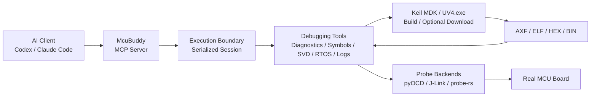

# McuBuddy — AI-Powered MCU and Embedded Firmware Debugging MCP Server

<!-- mcp-name: io.github.cunjun/mcubuddy -->

[](https://www.python.org/)
[](https://modelcontextprotocol.io/)
[](LICENSE)

**Languages:** [English](README.md) | [中文](README_zh.md)

**Extend AI from firmware analysis to real MCUs, closing the loop across diagnosis, code changes, build, flashing, and validation in verified environments.**

`McuBuddy` is a [Model Context Protocol (MCP)](https://modelcontextprotocol.io/) server for
MCU board-level debugging. It exposes debug probes, Keil MDK projects, ELF/DWARF symbols,
CPU and memory state, SVD peripheral registers, UART/RTT logs, FreeRTOS state, Flash operations,
and GDB servers as structured tools that AI assistants can call.

It is designed for firmware development, board bring-up, fault isolation, debugging automation,
and AI-assisted validation.

McuBuddy starts with 19 stable tools in the `default` toolset. Add only the domains a workflow
needs with `MCUBUDDY_TOOLSETS=probe,diagnose` (available domains: `probe`, `diagnose`,
`build_flash`, `rtos`, `logs`, and `experimental`). `MCUBUDDY_TOOL_PROFILE=full` remains the
compatibility option for exposing the complete governed catalog. Startup selection is immutable.

> [!IMPORTANT]
> Automation does not replace engineering responsibility. Humans remain responsible for goals and
> acceptance criteria, wiring and power safety, high-risk operation approval, code review, and new
> environment validation. Motors, relays, and other safety-related devices also require recovery
> plans and independent protection.

**Quick links:** [Quick Start](#-quick-start) · [Project Guide](PROJECT_GUIDE.md) ·
[Tool Reference](docs/tool-reference.md) · [Support Matrix](docs/support-matrix.md)

## ✨ Key Features

- **Real-hardware debugging**: Discover and connect to ST-Link, J-Link, CMSIS-DAP, and other
  probes; control target execution; and inspect registers, memory, breakpoints, and watchpoints.
- **Keil project workflow**: Discover `.uvprojx` / `.uvproj` files, select a target, invoke Keil
  MDK through `UV4.exe` for builds or downloads, and feed the generated AXF/ELF into debugging.
- **Source-level fault diagnosis**: Use ELF/DWARF data to resolve addresses to functions, source
  lines, local variables, and call stacks when investigating HardFaults, startup failures, stack
  overflows, and memory corruption.
- **Peripheral and RTOS inspection**: Decode peripheral registers through CMSIS-SVD and inspect
  FreeRTOS tasks, task contexts, and stack usage.
- **Logs and runtime observability**: Read UART, RTT, and selected J-Link SWO logs, and manage
  pyOCD/J-Link GDB server lifecycles.
- **Evidence-driven results**: Return structured target, state, and validation evidence so AI can
  continue an investigation instead of guessing code changes from symptoms alone.

## 🏗️ How It Works



MCP is not a protocol for invoking Keil. The AI calls `McuBuddy` through MCP; `McuBuddy` then
uses Keil MDK through `UV4.exe`, pyOCD, J-Link, or another internal backend as required.

## 🚀 Quick Start

### 1. Prerequisites

Basic requirements:

- Python 3.10 or later;
- a powered MCU development board;
- a correctly connected ST-Link, J-Link, or CMSIS-DAP probe;
- the target chip name;
- preferably, an ELF/AXF image containing debug information.

Keil build and download features require Windows with Keil MDK installed. McuBuddy invokes
µVision through `UV4.exe`, including in Keil MDK v5 installations.

### 2. Installation

```bash
pip install McuBuddy
```

Install the optional dependency when using the J-Link Python backend:

```bash
pip install "McuBuddy[jlink]"
```

For development from source:

```bash
git clone https://github.com/cunjun/McuBuddy.git
cd McuBuddy
pip install -e ".[dev]"
```

### 3. Configure an MCP Client

```json
{
  "mcpServers": {
    "McuBuddy": {
      "command": "McuBuddy",
      "args": []
    }
  }
}
```

For a Windows source checkout, explicitly configure the virtual-environment Python executable and
working directory. See [Installation and First Connection](PROJECT_GUIDE.md#3-installation-and-first-connection),
then restart the AI client.

### 4. Run a First Read-Only Check

After connecting the probe and powering the board, tell the AI:

```text
Use McuBuddy to inspect the current debugging environment, discover connected probes,
and perform a first read-only check of the board without writing Flash.
Before starting, tell me what information is still missing.
```

The recommended sequence is to check the environment and target first, then configure the probe
and read the minimum target state:

```text
doctor()
list_connected_probes()
match_chip_name("py32f030x8")
configure_probe(target="py32f030x8", backend="pyocd")
probe_connect(target="py32f030x8")
read_stopped_context()
```

`probe_connect` and `read_stopped_context` are available in the default `core` profile. Reading a
stable stopped context may halt the target, so it is still execution-changing. If the device must
not be halted, instruct the AI to perform only non-intrusive probe and environment checks.

## 💬 Automated Debugging Example

```text
Use McuBuddy to debug <project path>. The MCU is <exact model>, and the probe is
<ST-Link/J-Link/CMSIS-DAP>. First collect board-level evidence and locate the problem. After
authorization, modify the code, build and flash it, then validate the result on the real board.
```

For the evidence-first decision order and common scenarios, see
[Common Debugging Workflows](PROJECT_GUIDE.md#6-common-debugging-workflows).

## 🧰 Backends and Hardware Validation

| Path | Current Role | Main Capabilities |
| --- | --- | --- |
| pyOCD + ST-Link/CMSIS-DAP | Primary backend | Control, memory, Flash, source debugging, RTT, RTOS, and GDB server |
| J-Link | Primary backend | Control, memory, Flash, source debugging, native RTT, DWT, and GDB server |
| probe-rs sidecar | Extended preview | ARM/RISC-V/Xtensa discovery, configurable core control, registers, memory, hardware breakpoints, Flash, and RTT |
| Keil MDK (Windows, via `UV4.exe`) | Build/download backend | Project discovery, target configuration, build, logs, and optional download; supports MDK v5 installations |

Primary validation coverage includes:

- STM32L496VETx + ST-Link / pyOCD;
- STM32F103C8 + J-Link;
- built-in target preflight profiles for STM32F103ZE and PY32F030X8.

“Implemented in code” does not mean “validated on every board.” Use the
[Support Matrix](docs/support-matrix.md) and `list_validation_records()` as the source of truth.

## 🛡️ Safety Model

`McuBuddy` provides machine-readable safety classifications through `list_tool_safety()`.

| Category | Examples | Default Requirement |
| --- | --- | --- |
| Read-only | Target matching, register/memory reads, symbol resolution, logs, diagnostics | No confirmation required |
| Execution-changing | halt, resume, reset, continue, stepping | Does not write Flash, but changes execution state |
| Runtime-state write | Memory/register writes, breakpoints, watchpoints, SVD field writes | Explicit confirmation |
| Persistent destructive operation | Flash erase/program, Keil firmware download | Explicit confirmation |
| Host process | Keil build, GDB server start/stop | Starts or stops a local process |

Safety principles:

1. For an unknown target, match the chip and probe first; do not guess addresses.
2. Read evidence before halting, resetting, or writing.
3. Before a Flash operation, confirm the target, scope, image, and recovery method.
4. For motors, relays, power switches, and other actuators, prefer breakpoints and low-energy tests.
5. Send actuator commands with `uart_send_with_cleanup`, then call `finish_debug_session` before
   returning a final conclusion. Server shutdown repeats the same idempotent cleanup as a fallback.

## 🔒 Sessions and Concurrency

- Operations that share probe, Keil, ELF/SVD, log, and runtime configuration are serialized within
  the same `Session`.
- Different sessions can run concurrently when they control unrelated boards.
- Stateless queries such as target matching and tool safety information can run alongside session
  operations.
- Cancellation cannot forcibly terminate a call that has entered a synchronous SDK. The server
  waits for the worker thread to finish before releasing the session lock.

This prevents one request from switching backends, disconnecting the probe, or changing shared
state while another probe operation is still running.

## 📦 mcubuddy Skill

The repository includes `skills/mcubuddy`, which guides Codex and Claude Code to use these tools in an
“evidence first, judgment second” sequence instead of treating MCP tools as an unordered command list.

The Skill is an optional workflow enhancement, not a prerequisite for hardware debugging. A correctly
installed and configured local McuBuddy MCP server remains fully usable without it.

Install for Codex:

```powershell
python .\skills\mcubuddy\scripts\install_skill.py --target codex --overwrite
```

Install for Claude Code:

```powershell
python .\skills\mcubuddy\scripts\install_skill.py --target cc --overwrite
```

Restart the client or open a new session after installation. For source-checkout recovery,
installation registration, and usage boundaries, see
[Boundaries Between McuBuddy, MCP, and the Skill](PROJECT_GUIDE.md#2-boundaries-between-mcubuddy-mcp-and-the-skill)
for details.

## ⚠️ Current Limitations

- Keil build and download currently require Windows with Keil MDK and invoke µVision through
  `UV4.exe`, including in MDK v5 installations.
- The probe-rs sidecar covers Flash and RTT but still requires target-specific real-board
  validation and does not yet have an official binary release.
- RTOS inspection depends on FreeRTOS symbols and an ELF/AXF that match the target firmware.
- SVD files are not bundled automatically for every chip and usually come from a CMSIS-Pack or
  the chip vendor.
- SWO text capture depends on chip configuration, probe capabilities, pin multiplexing, and board wiring.
- Device patches and connection strategies remain lightweight mechanisms rather than a complete
  board plugin system.

## 📚 Documentation

- Complete project overview and workflows: [Project Guide](PROJECT_GUIDE.md)
- Chinese project overview: [项目指南](PROJECT_GUIDE_zh.md)
- Complete tool index: [Tool Reference](docs/tool-reference.md)
- Chinese tool usage: [MCP 工具中文参考](docs/mcp-tools-reference-zh.md)
- Backend and hardware validation: [Support Matrix](docs/support-matrix.md)
- Project design: [Architecture](docs/architecture.md)
- v0.5.2 release summary: [v0.5.2 Release Notes](docs/releases/v0.5.2.md)

## 🧪 Local Development

```bash
pip install -e ".[dev]"
pytest
ruff check src tests
```

See the [Project Guide](PROJECT_GUIDE.md) for repository layout and documentation ownership.

## 🙏 Upstream and Acknowledgements

McuBuddy is based on [SolarWang233/mcudbg](https://github.com/SolarWang233/mcudbg)
and continues its MIT-licensed work with additional architecture, safety boundaries, evidence
workflows, backend support, and documentation. The original copyright notice is preserved in
[LICENSE](LICENSE), with provenance details in [NOTICE](NOTICE).

## 📄 License

This project is licensed under the MIT License. See [LICENSE](LICENSE) for details.

---

If `McuBuddy` helps with your MCU debugging workflow, consider giving the project a Star.
If you have suggestions, open an Issue or email
[zhou229449@gmail.com](mailto:zhou229449@gmail.com).
