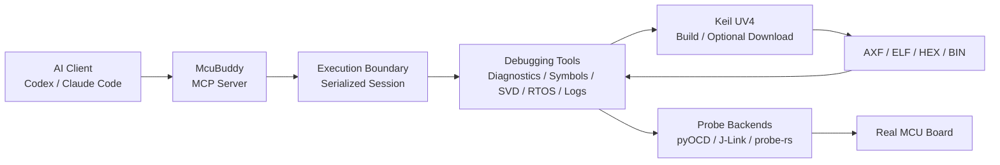

# McuBuddy — AI-Powered MCU and Embedded Firmware Debugging MCP Server

<!-- mcp-name: io.github.cunjun/mcubuddy -->

[](https://www.python.org/)
[](https://modelcontextprotocol.io/)
[](LICENSE)

**Languages:** [English](README.md) | [中文](README_zh.md)

**Let AI do more than analyze firmware code: connect to real MCUs, operate debugging tools, and collect board-level evidence.**

`McuBuddy` is a [Model Context Protocol (MCP)](https://modelcontextprotocol.io/) server for
MCU board-level debugging. It exposes debug probes, Keil MDK projects, ELF/DWARF symbols,
CPU and memory state, SVD peripheral registers, UART/RTT logs, FreeRTOS state, Flash operations,
and GDB servers as structured tools that AI assistants can call.

It is designed for firmware development, board bring-up, fault isolation, debugging automation,
and AI-assisted validation.

McuBuddy v0.5.2 starts with a focused `core` MCP tool profile by default. Set
`MCUBUDDY_TOOL_PROFILE=full` in the MCP server environment to expose the complete expert catalog
from earlier alpha releases.

> [!IMPORTANT]
> Together with AI clients such as Codex, McuBuddy supports a closed-loop workflow covering
> board-level evidence collection, diagnosis, code modification, build, firmware download,
> execution, and validation on validated hardware and toolchain combinations.
>
> Humans remain responsible for defining goals and acceptance criteria, wiring and power safety,
> authorizing operations that change execution or persistent state, reviewing code changes, and
> validating new MCU, probe, RTOS, and build-environment combinations. Motors, relays, production
> devices, and other safety-critical systems also require recovery plans and independent safety
> protection.

**Documentation:** [Project Guide](PROJECT_GUIDE.md) ·
[Tool Reference](docs/tool-reference.md) ·
[Support Matrix](docs/support-matrix.md) ·
[Architecture](docs/architecture.md)

## ✨ Key Features

- **Real-hardware debugging**: Discover and connect to ST-Link, J-Link, CMSIS-DAP, and other
  probes; control target execution; and inspect registers, memory, breakpoints, and watchpoints.
- **Keil project workflow**: Discover `.uvprojx` / `.uvproj` files, select a target, invoke UV4
  builds or downloads, and feed the generated AXF/ELF into the debugging workflow.
- **Source-level fault diagnosis**: Use ELF/DWARF data to resolve addresses to functions, source
  lines, local variables, and call stacks when investigating HardFaults, startup failures, stack
  overflows, and memory corruption.
- **Peripheral and RTOS inspection**: Decode peripheral registers through CMSIS-SVD and inspect
  FreeRTOS tasks, task contexts, and stack usage.
- **Logs and runtime observability**: Read UART, RTT, and selected J-Link SWO logs, and manage
  pyOCD/J-Link GDB server lifecycles.
- **Safety boundaries**: Classify tools as read-only, execution-changing, runtime-writing, or
  persistently destructive, with explicit confirmation for high-risk operations.
- **Core/full tool profiles**: Keep the default MCP schema small for common evidence-first flows,
  while preserving the complete expert catalog behind explicit startup configuration.
- **Evidence-driven results**: Return structured target, state, and validation evidence so AI can
  continue an investigation instead of guessing code changes from symptoms alone.

## 🏗️ How It Works



| Component | Responsibility |
| --- | --- |
| AI clients such as Codex and Claude Code | Understand the problem, select tools, interpret results, and propose the next checks |
| MCP | Standard tool-calling protocol between the AI client and `McuBuddy` |
| `McuBuddy` | Manage debug sessions, invoke backends, enforce safety checks, and return structured results |
| Keil MDK / UV4 | Build and link Keil projects, with optional configured firmware download |
| pyOCD, J-Link, and experimental probe-rs | Connect to probes and access target registers, memory, breakpoints, and Flash |
| ELF/AXF, DWARF, and SVD | Provide symbols, source locations, variables, call stacks, and peripheral-register semantics |

MCP is not a protocol for invoking Keil. The AI calls `McuBuddy` through MCP; `McuBuddy` then
uses Keil UV4, pyOCD, J-Link, or another internal backend as required by the task.

## 🚀 Quick Start

### 1. Prerequisites

Basic requirements:

- Python 3.10 or later;
- a powered MCU development board;
- a correctly connected ST-Link, J-Link, or CMSIS-DAP probe;
- the target chip name;
- preferably, an ELF/AXF image containing debug information.

Windows and an installed Keil MDK / UV4 are required only for Keil build or download features.

### 2. Installation

```bash
pip install McuBuddy
```

Install the optional dependency when using the J-Link Python backend:

```bash
pip install "McuBuddy[jlink]"
```

For development from source:

```bash
git clone https://github.com/cunjun/McuBuddy.git
cd McuBuddy
pip install -e ".[dev]"
```

### 3. Configure an MCP Client

```json
{
  "mcpServers": {
    "McuBuddy": {
      "command": "McuBuddy",
      "args": []
    }
  }
}
```

For a Windows source checkout, explicitly configure the virtual-environment Python executable and
working directory. See [Installation and First Connection](PROJECT_GUIDE.md#3-installation-and-first-connection),
then restart the AI client.

### 4. Run a First Read-Only Check

After connecting the probe and powering the board, tell the AI:

```text
Use McuBuddy to inspect the current debugging environment, discover connected probes,
and perform a first read-only check of the board without writing Flash.
Before starting, tell me what information is still missing.
```

The recommended sequence is to check the environment and target first, then configure the probe
and read the minimum target state:

```text
doctor()
list_connected_probes()
match_chip_name("py32f030x8")
configure_probe(target="py32f030x8", backend="pyocd")
probe_connect(target="py32f030x8")
read_stopped_context()
```

`probe_connect` and `read_stopped_context` are available in the default `core` profile. Reading a
stable stopped context may halt the target, so it is still execution-changing. If the device must
not be halted, instruct the AI to perform only non-intrusive probe and environment checks.

## 💬 Examples for AI Assistants

The following prompts can be given directly to an AI assistant connected to `McuBuddy`. Unless
explicitly authorized, it should start with read-only checks and explain the impact before
resetting, halting, flashing, or sending test data.

### Check Whether the Board Is Connected

```text
Use McuBuddy to check whether the <exact model> board is connected. The probe is
<ST-Link/J-Link/CMSIS-DAP>.
```

### Check Whether Communication Works

```text
Use McuBuddy to debug the Keil project under <firmware project path>. The MCU is <exact model>,
the probe is <ST-Link/J-Link/CMSIS-DAP>, and the interface is <USART1/SPI1/I2C1/CAN/etc.>.
Check whether initialization, transmit and receive paths, protocol handling, and communication on
the real board have problems.
```

### Board Does Not Start or Keeps Resetting

```text
Use McuBuddy to find out why the board for <firmware project path> does not start, repeatedly resets,
or crashes after running.
```

### Peripheral Does Not Respond

```text
Use McuBuddy to check why <LED/motor/sensor/other peripheral> does not respond and whether its
initialization or control logic has problems.
```

### Program Stops Running

```text
Use McuBuddy to check why the program stalls, a task does not run, or the system stops after some
time.
```

For the evidence-first decision order and common scenarios, see
[Common Debugging Workflows](PROJECT_GUIDE.md#6-common-debugging-workflows).

## 🧰 Capabilities and Backend Support

### Capability Categories

| Category | Main Capabilities |
| --- | --- |
| Probes and targets | Probe discovery, target matching, connect/disconnect, halt/resume, reset, and stepping |
| CPU and memory | Core/FPU/fault registers, memory access, stopped context, Flash comparison, and verification |
| Breakpoints and execution | Hardware/software breakpoints, watchpoints, run-to-function/source, and Step Over/Out |
| Symbols and source | ELF/AXF, DWARF, disassembly, functions, variables, source mapping, and call stacks |
| Peripherals and RTOS | CMSIS-SVD, peripheral fields, FreeRTOS tasks, task contexts, and stack checks |
| Logs and services | UART, RTT, selected SWO, and pyOCD/J-Link GDB servers |
| Projects and diagnostics | Keil project discovery, build/download, HardFault, startup, clock, interrupt, and peripheral diagnosis |

For complete tool names, parameters, and return values, see the
[Tool Reference](docs/tool-reference.md).

### Backend Support Status

| Path | Current Role | Main Capabilities |
| --- | --- | --- |
| pyOCD + ST-Link/CMSIS-DAP | Primary backend | Control, memory, Flash, source debugging, RTT, RTOS, and GDB server |
| J-Link | Primary backend | Control, memory, Flash, source debugging, native RTT, DWT, and GDB server |
| probe-rs sidecar | Extended preview | ARM/RISC-V/Xtensa discovery, configurable core control, registers, memory, hardware breakpoints, Flash, and RTT |
| Keil UV4 (Windows) | Build/download backend | Project discovery, target configuration, build, logs, and optional download |

Primary validation coverage includes:

- STM32L496VETx + ST-Link / pyOCD;
- STM32F103C8 + J-Link;
- built-in target preflight profiles for STM32F103ZE and PY32F030X8.

“Implemented in code” does not mean “validated on every board.” Use the
[Support Matrix](docs/support-matrix.md) and `list_validation_records()` as the source of truth.

## 🔄 Keil MDK / UV4 Workflow

Keil provides project build, linking, and optional firmware download. `McuBuddy` does not replace
the Keil compiler or parse and rewrite project build rules. It discovers projects, selects targets,
invokes UV4, reads logs and output files, and feeds the results into automated debugging.

`McuBuddy` will locate the Keil project and output files, connect to the board, and collect evidence
as needed. It will explain the impact before building, downloading, or changing the board's running
state. See the [Project Guide](PROJECT_GUIDE.md) for detailed tool calls and new-project setup.

## 🛡️ Safety Model

`McuBuddy` provides machine-readable safety classifications through `list_tool_safety()`.

| Category | Examples | Default Requirement |
| --- | --- | --- |
| Read-only | Target matching, register/memory reads, symbol resolution, logs, diagnostics | No confirmation required |
| Execution-changing | halt, resume, reset, continue, stepping | Does not write Flash, but changes execution state |
| Runtime-state write | Memory/register writes, breakpoints, watchpoints, SVD field writes | Explicit confirmation |
| Persistent destructive operation | Flash erase/program, Keil firmware download | Explicit confirmation |
| Host process | Keil build, GDB server start/stop | Starts or stops a local process |

Safety principles:

1. For an unknown target, match the chip and probe first; do not guess addresses.
2. Read evidence before halting, resetting, or writing.
3. Before a Flash operation, confirm the target, scope, image, and recovery method.
4. For motors, relays, power switches, and other actuators, prefer breakpoints and low-energy tests.

## 🔒 Sessions and Concurrency

- Operations that share probe, Keil, ELF/SVD, log, and runtime configuration are serialized within
  the same `Session`.
- Different sessions can run concurrently when they control unrelated boards.
- Stateless queries such as target matching and tool safety information can run alongside session
  operations.
- Cancellation cannot forcibly terminate a call that has entered a synchronous SDK. The server
  waits for the worker thread to finish before releasing the session lock.

This prevents one request from switching backends, disconnecting the probe, or changing shared
state while another probe operation is still running.

## 📦 mcubuddy Skill

The repository includes `skills/mcubuddy`, which guides Codex and Claude Code to use these tools in an
“evidence first, judgment second” sequence instead of treating MCP tools as an unordered command list.

The Skill is an optional workflow enhancement, not a prerequisite for hardware debugging. A correctly
installed and configured local McuBuddy MCP server must remain fully usable without it. To let the
Skill rediscover a source checkout when MCP is unavailable, run
`McuBuddy home set C:\path\to\McuBuddy --confirm`; the path is stored in the user-level
`.mcubuddy/installations.json` registry, never in `SKILL.md`.

Install for Codex:

```powershell
python .\skills\mcubuddy\scripts\install_skill.py --target codex --overwrite
```

Install for Claude Code:

```powershell
python .\skills\mcubuddy\scripts\install_skill.py --target cc --overwrite
```

Restart the client or open a new session after installation. See
[Boundaries Between McuBuddy, MCP, and the Skill](PROJECT_GUIDE.md#2-boundaries-between-mcubuddy-mcp-and-the-skill)
for details.

## ⚠️ Current Limitations

- Keil build and download currently target Windows + Keil UV4.
- The probe-rs sidecar covers Flash and RTT but still requires target-specific real-board
  validation and does not yet have an official binary release.
- RTOS inspection depends on FreeRTOS symbols and an ELF/AXF that match the target firmware.
- SVD files are not bundled automatically for every chip and usually come from a CMSIS-Pack or
  the chip vendor.
- SWO text capture depends on chip configuration, probe capabilities, pin multiplexing, and board wiring.
- Device patches and connection strategies remain lightweight mechanisms rather than a complete
  board plugin system.

## 📚 Documentation

- Complete project overview and workflows: [Project Guide](PROJECT_GUIDE.md)
- Chinese project overview: [项目指南](PROJECT_GUIDE_zh.md)
- Complete tool index: [Tool Reference](docs/tool-reference.md)
- Chinese tool usage: [MCP 工具中文参考](docs/mcp-tools-reference-zh.md)
- Backend and hardware validation: [Support Matrix](docs/support-matrix.md)
- Project design: [Architecture](docs/architecture.md)
- v0.5.2 release summary: [v0.5.2 Release Notes](docs/releases/v0.5.2.md)

## 🧪 Local Development

```bash
pip install -e ".[dev]"
pytest
ruff check src tests
```

See the [Project Guide](PROJECT_GUIDE.md) for repository layout and documentation ownership.

## 🙏 Upstream and Acknowledgements

McuBuddy is based on [SolarWang233/mcudbg](https://github.com/SolarWang233/mcudbg)
and continues its MIT-licensed work with additional architecture, safety boundaries, evidence
workflows, backend support, and documentation. The original copyright notice is preserved in
[LICENSE](LICENSE), with provenance details in [NOTICE](NOTICE).

## 📄 License

This project is licensed under the MIT License. See [LICENSE](LICENSE) for details.

---

If `McuBuddy` helps with your MCU debugging workflow, consider giving the project a Star.
If you have any good ideas for `McuBuddy`, you can also send your thoughts to `zhou229449@gmail.com`. Thanks.
