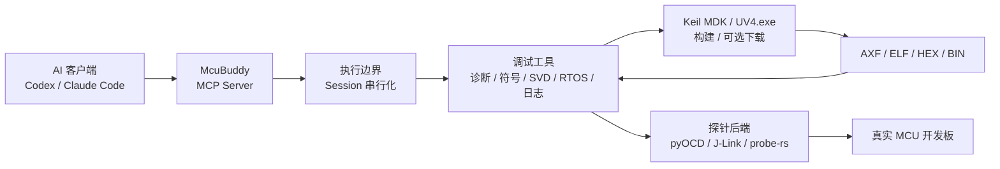

# McuBuddy — MCU 与嵌入式固件 AI 调试 MCP 服务

[](https://www.python.org/)
[](https://modelcontextprotocol.io/)
[](LICENSE)

**语言版本：** [English](README.md) | [中文](README_zh.md)

**让 AI 从分析固件代码延伸到真实 MCU，在已验证环境中形成诊断、修改、构建、烧录和验证闭环。**

`McuBuddy` 是一个面向 MCU 板级调试的
[Model Context Protocol（MCP）](https://modelcontextprotocol.io/) 服务端。它把调试探针、
Keil MDK 工程、ELF/DWARF 符号、CPU 与内存状态、SVD 外设寄存器、UART/RTT 日志、
FreeRTOS 状态、Flash 操作和 GDB Server 统一成 AI 助手可以调用的结构化工具。

它适合固件开发、板卡 Bring-up、故障定位、调试自动化和 AI 辅助验证。

McuBuddy 默认使用 `core` 工具面，只启用 `default` toolset 中的 19 个稳定工具。根据工作流按需通过
`MCUBUDDY_TOOLSETS=probe,diagnose` 增加领域工具；可选目录为 `probe`、`diagnose`、
`build_flash`、`rtos`、`logs` 和 `experimental`。项目不提供一次性暴露全部工具的
兼容配置；工具集合在服务启动时确定，运行中不会动态扩大。

> [!IMPORTANT]
> 自动化不替代工程责任。人仍负责调试目标与验收标准、接线与供电安全、高风险操作授权、
> 代码审查和新环境验证；电机、继电器及其他安全相关设备还需具备恢复方案和独立保护。

**快速入口：** [快速开始](#-快速开始) · [项目指南](PROJECT_GUIDE_zh.md) ·
[工具索引](docs/tool-reference.md) · [支持矩阵](docs/support-matrix.md)

## ✨ 核心能力

- **真实硬件调试**：发现并连接 ST-Link、J-Link、CMSIS-DAP 等探针，控制目标运行状态，
  读取寄存器、内存、断点和观察点。
- **Keil 工程闭环**：发现 `.uvprojx` / `.uvproj`，选择 Target，通过 Keil MDK 的
  `UV4.exe` 执行构建或下载，
  并将生成的 AXF/ELF 接入后续调试。
- **源码级故障诊断**：利用 ELF/DWARF 将地址还原为函数、源码行、局部变量和调用栈，
  辅助分析 HardFault、启动失败、栈溢出和内存破坏。
- **外设与 RTOS 检查**：通过 CMSIS-SVD 解码外设寄存器，检查 FreeRTOS 任务、任务上下文
  和栈使用情况。
- **日志与运行观测**：读取 UART、RTT 和部分 J-Link SWO 日志，管理 pyOCD/J-Link
  GDB Server 生命周期。
- **证据驱动**：返回结构化的目标、状态和验证结果，让 AI 基于板级证据继续排查，
  而不是只根据现象猜测修改代码。
- **可执行的硬件边界反馈**：区分 MCU 硬件限制、固件不适用、配置问题、工具故障和证据不足，
  同时说明判断依据、影响与下一项安全检查，避免把不支持的能力误判为固件缺陷。

## 🏗️ 工作原理



MCP 不是“调用 Keil 的协议”。AI 通过 MCP 调用 `McuBuddy`；`McuBuddy` 再根据任务使用
Keil MDK（通过 `UV4.exe`）、pyOCD、J-Link 或其他内部后端。

## 🚀 快速开始

### 1. 准备环境

基本要求：

- Python 3.10 或更高版本；
- 一块已供电的 MCU 开发板；
- 正确连接的 ST-Link、J-Link 或 CMSIS-DAP 探针；
- 目标芯片名称；
- 推荐准备带调试信息的 ELF/AXF。

只有使用 Keil 构建或下载功能时，才需要 Windows 和已安装的 Keil MDK。McuBuddy 通过
`UV4.exe` 调用 µVision，包括 Keil MDK v5 的安装环境。

### 2. 安装

```bash
pip install "McuBuddy @ git+https://github.com/cunjun/McuBuddy.git"
```

这会在本机安装一次 McuBuddy，供所有本地固件项目使用；无需在每个目标项目中 clone、复制或
vendor McuBuddy。McuBuddy 是纯本地 MCP 后端：客户端为每个连接启动一个独立的 `stdio`
进程，McuBuddy 不提供 HTTP、SSE、WebSocket 或其他 MCP 网络监听。

目标工程、Keil、ELF/SVD、调试探针和串口必须对运行 McuBuddy 的本机直接可见。需要更新时，
由用户从官方仓库 `https://github.com/cunjun/McuBuddy` 主动重新安装；McuBuddy 不会自动检查、
下载或安装更新。

使用 J-Link Python 后端时安装可选依赖：

```bash
pip install "McuBuddy[jlink]"
```

从源码开发：

```bash
git clone https://github.com/cunjun/McuBuddy.git
cd McuBuddy
pip install -e ".[dev]"
```

### 3. 配置 MCP 客户端

```json
{
  "mcpServers": {
    "McuBuddy": {
      "command": "McuBuddy",
      "args": [],
      "env": {
        "MCUBUDDY_TOOLSETS": "probe,diagnose"
      }
    }
  }
}
```

不设置 `MCUBUDDY_TOOLSETS` 时只注册 19 个默认工具。按任务选择目录：

| toolset | 用途 |
| --- | --- |
| `default` | 环境检查、配置、连接和会话生命周期，始终启用 |
| `probe` | 寄存器、内存、断点、单步、ELF/SVD 和底层探针操作 |
| `diagnose` | HardFault、启动、外设、时钟和内存问题诊断 |
| `build_flash` | Keil/GDB Server、构建、烧录和校验 |
| `rtos` | RTOS 任务与上下文检查 |
| `logs` | UART、RTT、SWO 和日志连接 |
| `experimental` | 预览、演示和兼容能力 |

修改 toolset 后必须重启 MCP 客户端。只选择当前工作流需要的领域；旧版聚合工具面
已经移除。

Windows 源码环境建议显式配置虚拟环境 Python 和工作目录，详见
[安装与首次连接](PROJECT_GUIDE_zh.md#3-安装与首次连接)。配置后重新启动 AI 客户端。

### 4. 第一次只读检查

连接探针并给开发板供电后，可以直接告诉 AI：

```text
请使用 McuBuddy 检查当前调试环境，查找已连接的探针，并在不写入 Flash 的前提下
对开发板做第一次只读检查。开始前先告诉我还缺少哪些信息。
```

推荐先运行环境和目标预检，再配置探针并读取最小状态：

```text
doctor()
list_connected_probes()
match_chip_name("py32f030x8")
configure_probe(target="py32f030x8", backend="pyocd")
probe_connect(target="py32f030x8")
read_stopped_context()
```

`probe_connect` 和 `read_stopped_context` 均属于默认 19 个工具。读取稳定上下文时可能
暂停目标，因此仍属于执行状态变化。如果设备不能被暂停，应先告诉 AI 只做非侵入式探针和环境检查。

## 💬 自动化调试示例

```text
使用 McuBuddy 调试 <工程路径>。MCU 为 <具体型号>，探针为
<ST-Link/J-Link/CMSIS-DAP>。先收集实机证据并定位问题；经授权后修改代码、编译和烧录，
最后在真实开发板上验证结果。
```

更多证据驱动的决策顺序和场景见
[常见调试流程](PROJECT_GUIDE_zh.md#6-常见调试流程)。

## 🧰 后端与硬件验证

| 路径 | 当前定位 | 主要能力 |
| --- | --- | --- |
| pyOCD + ST-Link/CMSIS-DAP | 主要后端 | 控制、内存、Flash、源码调试、RTT、RTOS、GDB Server |
| J-Link | 主要后端 | 控制、内存、Flash、源码调试、原生 RTT、DWT、GDB Server |
| probe-rs sidecar | 扩展预览 | ARM/RISC-V/Xtensa 发现、可配置核心控制、寄存器、内存、硬件断点、Flash、RTT |
| Keil MDK（Windows，通过 `UV4.exe`） | 构建/下载后端 | 工程发现、Target 配置、构建、日志、可选下载；支持 MDK v5 安装环境 |

已重点验证：

- STM32L496VETx + ST-Link / pyOCD；
- STM32F103C8 + J-Link；
- 内置目标预检还包括 STM32F103ZE 和 PY32F030X8。

“代码已实现”不等于“所有板卡均已验证”。准确记录以
[Support Matrix](docs/support-matrix.md) 和 `list_validation_records()` 为准。

## 🛡️ 安全模型

`McuBuddy` 为工具提供机器可读的安全分类，可通过 `list_tool_safety()` 查询。

| 类别 | 例子 | 默认要求 |
| --- | --- | --- |
| 只读 | 目标匹配、寄存器/内存读取、符号解析、日志、诊断 | 不要求确认 |
| 执行状态变化 | halt、resume、reset、continue、单步 | 不写 Flash，但会改变运行状态 |
| 运行时状态写入 | 内存/寄存器写入、断点、观察点、SVD 字段写入 | 明确确认 |
| 持久性破坏操作 | Flash 擦除、编程、Keil 固件下载 | 明确确认 |
| 主机进程 | Keil 构建、GDB Server 启停 | 会启动或停止本机进程 |

安全原则：

1. 未知目标先匹配芯片和探针，不猜测地址。
2. 优先读取证据，再暂停、复位或写入。
3. Flash 操作前确认目标、范围、镜像和恢复方式。
4. 电机、继电器、电源开关等执行器优先使用断点和低能量测试。

## 🔒 Session 与并发行为

- 同一个 `Session` 中，共享探针、Keil、ELF/SVD、日志和运行配置的操作会串行执行。
- 不同 Session 可以并行，适合互不相关的多块开发板。
- 目标匹配、工具安全信息等无状态查询可以与 Session 操作并发。
- 取消请求不能强行终止已经进入同步 SDK 的调用；服务器会等工作线程结束后再释放 Session 锁。
- 电机、继电器、加热器等执行器应通过 `uart_send_with_cleanup` 同时登记停止命令；给出最终结论前调用
  `finish_debug_session`。服务退出时会以幂等方式再次执行同一套安全收尾作为兜底。

这可以避免一个探针操作尚未完成时，另一个请求同时切换后端、断开连接或修改共享状态。

## 📦 mcubuddy Skill

仓库包含 `skills/mcubuddy`，用于指导 Codex 和 Claude Code 按“先证据、后判断”的顺序使用
这些工具，而不是把 MCP 工具当作无序命令列表。

Skill 是可选的工作流增强，不是硬件调试的前置条件。McuBuddy MCP 服务正确安装和配置后，
即使不安装 Skill，也可以使用完整的硬件调试能力。

正式安装包已内置 Skill，普通用户无需克隆 Git 仓库即可完成 Codex 持久注册：

```powershell
uv tool install McuBuddy
McuBuddy setup codex --confirm --json
```

安装到 Codex：

```powershell
python .\skills\mcubuddy\scripts\install_skill.py --target codex --overwrite
```

安装到 Claude Code：

```powershell
python .\skills\mcubuddy\scripts\install_skill.py --target cc --overwrite
```

安装后重启客户端或新建会话。源码目录恢复、安装注册和使用边界详见
[McuBuddy、MCP 与 Skill 的边界](PROJECT_GUIDE_zh.md#2-mcubuddymcp-与-skill-的边界)。

## ⚠️ 当前限制

- Keil 构建和下载目前面向 Windows + Keil MDK，通过 `UV4.exe` 调用 µVision，包括
  MDK v5 安装环境。
- probe-rs sidecar 已覆盖 Flash 和 RTT，但仍需按目标芯片做真实板验证，且尚未提供正式发布二进制。
- RTOS 检查依赖与目标固件匹配的 FreeRTOS 符号和 ELF/AXF。
- SVD 文件不随所有芯片自动提供，通常需要来自 CMSIS-Pack 或芯片厂商。
- SWO 文本捕获受芯片配置、探针能力、引脚复用和板级接线影响。
- 设备补丁和连接策略仍是轻量机制，不是完整的板卡插件系统。

## 📚 文档导航

- 完整项目说明与工作流：[项目指南](PROJECT_GUIDE_zh.md)
- 英文项目说明：[Project Guide](PROJECT_GUIDE.md)
- 完整工具索引：[Tool Reference](docs/tool-reference.md)
- MCP 工具中文用途：[MCP 工具中文参考](docs/mcp-tools-reference-zh.md)
- 后端与硬件验证：[Support Matrix](docs/support-matrix.md)
- 项目架构：[Architecture](docs/architecture.md)
- 发布历史：[Changelog](CHANGELOG.md)

## 🧪 本地开发

```bash
pip install -e ".[dev]"
pytest
ruff check src tests
```

项目目录约定和文档归属见 [项目指南](PROJECT_GUIDE_zh.md)。

## 🙏 上游来源与致谢

McuBuddy 基于 [SolarWang233/mcudbg](https://github.com/SolarWang233/mcudbg) 开发，并在其
MIT License 授权的代码基础上扩展了架构、安全边界、证据工作流、后端支持和文档。
原始版权声明保留在 [LICENSE](LICENSE) 中，来源详情见 [NOTICE](NOTICE)。

## 📄 License

本项目采用 MIT License，详见 [LICENSE](LICENSE)。

---

如果 `McuBuddy` 对你的 MCU 调试工作有帮助，欢迎给项目一个 Star。
如果你对 `McuBuddy` 有建议，欢迎提交 Issue，或发送邮件至
[zhou229449@gmail.com](mailto:zhou229449@gmail.com)。
