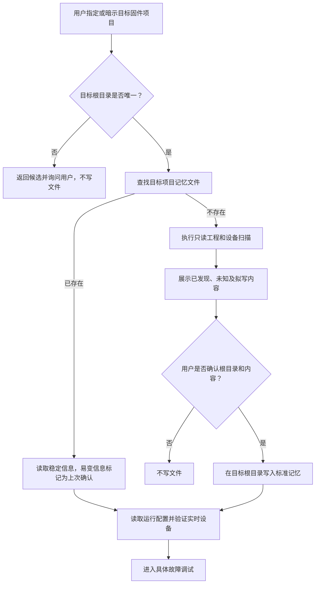

# 目标固件项目记忆与新用户引导 - Plan

## Goal Capsule

- **目标：** `mcubug` 优先从被调试固件项目自己的记忆文件恢复上下文；记忆缺失时，引导新用户完成只读扫描和确认。
- **最高依据：** 用户明确指定的目标项目根目录优先级最高。扫描结果只能作为候选；候选不唯一时必须让用户选择。
- **目录边界：** McuBuddy 仓库只保存通用实现和 Skill 规则。不能因为 Skill 位于 McuBuddy，就把其他固件项目的记忆写入 McuBuddy。
- **停止条件：** 目标根目录缺失、存在歧义、未经确认、写入路径越界，或者误指向 McuBuddy 仓库时，禁止创建或更新记忆文件。

---

## Product Contract

### 问题说明

当前 Skill 只能恢复 MCP 会话内配置，也能扫描 Keil 工程，但没有读取和维护“目标固件项目长期记忆”的能力。新用户因此会被要求提供芯片、Keil、烧录器、串口和烧录方式等专业参数。若直接增加记忆写入，又可能错误地将目标项目资料写进 McuBuddy 仓库。

### Requirements

**目标项目识别**

- R1. 优先使用用户明确提供的目标固件路径；没有明确路径时，才根据唯一的 Keil 工程扫描结果推导候选根目录。
- R2. 不得仅根据当前工作目录或 Skill 来源，将 McuBuddy 仓库判断为目标固件项目。
- R3. 没有候选或存在多个候选时，只返回候选和缺失信息，不进行任何写入。

**项目记忆生命周期**

- R4. 确认目标根目录后，必须先查找该项目已有的记忆文件，再执行新用户扫描。
- R5. 记忆中的 Keil 工程、芯片型号和构建方式等稳定信息可以复用；串口号、探针 ID、当前固件版本等易变信息只能作为“上次确认值”，每次任务进行轻量验证。
- R6. 没有记忆文件时，先完成只读扫描，分别展示已发现、待确认和未知信息；只有用户确认目标根目录和建议内容后，才能创建标准记忆文件。
- R7. 只有来自工程文件、设备枚举、实际验证或用户明确确认的信息才能写成事实；推测必须保持为待确认或未知。

**新用户引导**

- R8. 使用通俗中文解释 Keil 工程、Keil 程序、芯片、调试器/烧录器、串口、后端和烧录方式，不要求新用户先理解这些术语。
- R9. 能自动发现的信息不得反问用户，只询问无法可靠判断的内容。
- R10. 必须区分串口通信接口与调试/烧录接口；即使同一硬件同时提供两种接口，也不能将 COM 口直接当作烧录器。

### Acceptance Examples

- AE1. **覆盖 R1、R2、R4、R5：** 用户指定一个已有记忆文件的固件项目时，新任务先读取项目记忆，只重新检查串口和探针等易变状态。
- AE2. **覆盖 R1、R3、R6：** 一个搜索目录下存在两个 Keil 工程时，仅返回候选工程，用户选择前不创建文件。
- AE3. **覆盖 R2、R6：** 当前工作区是 McuBuddy，但用户指定了另一个固件项目时，只允许在被指定固件项目下提出记忆文件创建方案。
- AE4. **覆盖 R6、R7：** 扫描到 Keil 工程但没有检测到探针或串口时，保留硬件字段为未知，不填入猜测值。
- AE5. **覆盖 R8、R9、R10：** 面对新用户，先说明发现的设备及用途，再提出一个聚焦问题，而不是要求用户填写完整专家配置表。

### 范围边界

- 第一版只支持项目本地 Markdown 记忆文件，不建设全局项目数据库。
- 扫描阶段不连接、复位、停核或烧录硬件。
- 可以读取目标项目已有的说明文件作为证据，但不能覆盖或改造成 McuBuddy 标准记忆。
- 仅凭 USB 元数据无法可靠判断某个串口的业务用途时，保持待确认。

---

## Planning Contract

### Key Technical Decisions

- KTD1. **标准文件和兼容查找：** 新建文件统一使用 `.mcubuddy/project-memory.md`；兼容读取目标根目录下的 `.mcubuddy/project-memory.md`、`PROJECT_MEMORY.md` 和 `MEMORY.md`。已有文件原地读取，不擅自迁移或覆盖。该决定由用户明确要求：记忆属于被调试固件项目，而不是 McuBuddy 仓库。
- KTD2. **只读检查与写入分离：** 第一步只返回目标根目录、现有记忆、扫描证据、不确定项和拟写内容；第二步必须带 `confirm=True` 才能创建文件。
- KTD3. **目标根目录写入保护：** 解析真实目标根目录和目标文件路径，确保目标文件始终位于已确认根目录内，同时应用 `security.allowed_file_paths`。除非用户明确把 McuBuddy 本身作为被调试目标，否则拒绝在 McuBuddy 根目录创建项目记忆。
- KTD4. **证据状态分级：** 工具返回值中的字段使用 `confirmed`、`detected`、`last_known` 和 `unknown` 四种状态；Markdown 文档通过“已确认”“上次确认”“待确认”章节保留这种区别。
- KTD5. **Skill 调用顺序：** 先识别目标项目并读取项目记忆，再读取 `get_runtime_config()`，最后枚举当前探针和串口等实时状态。

### High-Level Technical Design

### 实施顺序

先实现目标根目录解析和记忆读取，再实现受保护的写入工具，最后更新 Skill。这样 Skill 不会提前引用尚未存在的 MCP 工具。

---

## Implementation Units

### U1. 目标根目录与记忆发现

- **目标：** 在不写文件的前提下，确定目标项目、读取已有记忆并生成结构化扫描建议。
- **覆盖需求：** R1-R5、R7。
- **文件：** `src/McuBuddy/tools/project_memory.py`、`src/McuBuddy/tools/project.py`、`tests/unit/test_project_memory.py`、`tests/integration/test_project_tools.py`。
- **实现边界：** 增加路径规范化、记忆候选查找、Markdown 读取、Keil 元数据复用和证据状态输出。候选不唯一时不得自动选择。
- **测试场景：**
  - 明确指定的目标根目录优先于当前工作目录。
  - 能识别标准文件名和兼容文件名。
  - 多个记忆文件或多个工程候选返回歧义结果。
  - 记忆缺失时只返回拟写内容，不创建文件。
  - 从记忆读取的串口和探针字段被标记为 `last_known`。
  - 当前目录为 McuBuddy、目标为其他固件目录时，结果仍指向固件目录。

### U2. 安全创建目标项目记忆

- **目标：** 只在已确认的目标固件根目录中创建或更新标准记忆文件。
- **覆盖需求：** R2、R3、R6、R7。
- **文件：** `src/McuBuddy/tools/project_memory.py`、`src/McuBuddy/security_guards.py`、`src/McuBuddy/tool_safety.py`、`tests/unit/test_project_memory.py`、`tests/unit/test_tool_safety.py`。
- **实现边界：** 要求 `confirm=True`，拒绝路径穿越和符号链接逃逸，应用允许路径策略，使用原子替换写入；兼容文件只读，不自动覆盖。
- **测试场景：**
  - `confirm=False` 只返回预览。
  - 标准文件能在临时目标项目内创建。
  - 目录穿越、符号链接越界和允许路径外写入均被拒绝。
  - 已存在标准文件时，没有明确更新意图不得覆盖。
  - 未明确选择 McuBuddy 为目标时，拒绝向其根目录写入项目记忆。

### U3. Core MCP 工具面

- **目标：** 通过现有安全和会话执行边界暴露记忆检查与确认写入能力。
- **覆盖需求：** R1-R7。
- **文件：** `src/McuBuddy/mcp_tools/runtime.py`、`src/McuBuddy/tool_profiles.py`、`src/McuBuddy/tool_safety.py`、`docs/tool-reference.md`、`tests/integration/test_tool_profiles.py`、`tests/unit/test_tool_profile_docs.py`。
- **实现边界：** 在 core 中增加只读 `inspect_project_memory` 和需要确认的 `write_project_memory`；两个工具均不得访问硬件。
- **测试场景：**
  - 两个工具都注册在 core。
  - 检查工具被标记为只读。
  - 写入工具必须确认，并被标记为文件系统写入。
  - 工具参考、core 白名单和安全表保持一致。

### U4. Skill 新用户与已知项目流程

- **目标：** 让新任务优先读取目标项目记忆，让新用户通过发现结果理解并补齐缺失信息。
- **覆盖需求：** R1-R10。
- **文件：** `skills/mcubug/SKILL.md`、`docs/ai-playbook.md`、`docs/generic-board-workflow.md`、`docs/ai-examples.md`、`docs/quickstart.md`、`skills/mcubug/references/`、`tests/unit/test_tool_profile_docs.py`、`tests/evaluation/gpt5p6_scenarios.yaml`。
- **实现边界：** 在 Skill 前部明确“记忆属于目标固件项目”。流程分为已有记忆、新用户无记忆和专家直接配置三条路径。
- **测试场景：**
  - 已有记忆时，在 `get_runtime_config()` 之前读取。
  - 没有记忆时先只读检查，而不是直接调用 `first_contact()`。
  - Skill 明确禁止默认向 McuBuddy 仓库写入其他项目记忆。
  - 新用户场景能解释串口与烧录器的区别，并区分已发现和未知信息。
  - 专家已提供完整参数时不重复进入新用户引导。

---

## Verification Contract

| 验证项 | 命令 | 通过标准 |
| --- | --- | --- |
| 项目记忆行为 | `.venv/Scripts/python.exe -m pytest tests/unit/test_project_memory.py tests/integration/test_project_tools.py -q` | 发现和写入边界场景全部通过 |
| 工具契约 | `.venv/Scripts/python.exe -m pytest tests/unit/test_tool_safety.py tests/unit/test_tool_profiles.py tests/integration/test_tool_profiles.py tests/unit/test_tool_profile_docs.py -q` | core 工具面和安全分类一致 |
| Skill 引用同步 | `.venv/Scripts/python.exe skills/mcubug/scripts/sync_references.py --check` | 没有过期引用 |
| Skill 校验 | `.venv/Scripts/python.exe skills/mcubug/scripts/validate_skill.py` | 校验通过 |
| 文档校验 | `.venv/Scripts/python.exe scripts/validate_docs.py` | 校验通过 |
| Diff 卫生 | `git diff --check` | 没有空白错误 |

---

## Definition of Done

- Skill 在读取运行配置前，先识别目标固件项目并查找其项目记忆。
- 记忆缺失时，任何写入前都能看到只读扫描结果和拟写内容。
- 记忆写入无法逃离已确认的目标根目录，也不会默认落入 McuBuddy 仓库。
- 已确认、扫描发现、上次确认和未知信息保持可区分。
- 新用户只需要回答无法自动发现的问题，并能理解串口和烧录器的不同用途。
- 工具面、安全、文档、引用同步和评估场景全部通过。
- McuBuddy 的变更中不包含任何具体固件项目的记忆文件。
