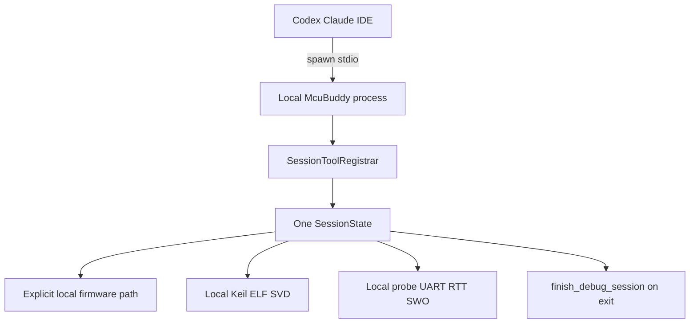

# McuBuddy Local Stdio Backend Productization Plan

## Goal Capsule

- **目标：** 将 McuBuddy 产品化为“用户主动安装一次、无需把 McuBuddy 源码放进每个固件项目、可服务任意本地固件工程”的纯本地 MCP 后端。
- **唯一传输：** 永久只使用 MCP `stdio`；MCP客户端按需启动独立 McuBuddy 子进程，McuBuddy 不监听任何TCP端口。
- **资源位置：** 目标工程、Keil、ELF/SVD、CMSIS-Pack、USB探针、J-Link DLL和串口必须位于运行McuBuddy的本机或对本机文件系统直接可见。
- **更新方式：** 不实现自动检查、自动下载或自动更新；用户需要更新时，主动从 `https://github.com/cunjun/McuBuddy` 重新安装。
- **完成信号：** 用户安装McuBuddy后，只需在MCP客户端配置本地命令，即可在任意本地固件项目中使用；项目中无需复制、vendor或clone McuBuddy。

---

## Product Contract

### Summary

McuBuddy程序自身与目标固件项目完全分离。
用户从官方GitHub仓库主动安装McuBuddy，MCP客户端通过 `stdio` 启动一个本地进程；该进程以显式路径读取固件工程并直接访问本机工具链和硬件。

### Problem Frame

当前项目已经具备Python发布包、`McuBuddy`命令入口、`stdio` MCP服务以及按路径发现Keil工程的能力，但源码checkout安装、发布包安装、McuBuddy安装目录和目标固件目录在部分文档及诊断逻辑中仍有混淆。
本方案只解决安装与项目分离问题，不把McuBuddy改造成网络服务。

### Requirements

**本地运行边界**

- R1. McuBuddy永久只支持本地 `stdio` MCP传输，不增加Streamable HTTP、SSE、WebSocket、TCP监听或远程控制端点。
- R2. 每个MCP客户端连接由客户端启动独立McuBuddy进程；不同进程不共享 `SessionState`、探针连接、串口连接或调试产物。
- R3. 不实现后台常驻服务、Windows Service、托盘服务、浏览器服务、多客户端租约、账号、令牌或远程认证。
- R4. McuBuddy不得为远程使用主动开放GDB Server、调试端口或其他网络监听；现有相关能力维持默认回环和明确确认边界，不作为McuBuddy后端传输。

**安装与更新**

- R5. 用户无需在每个固件项目中clone或复制McuBuddy；McuBuddy只需要在本机独立安装一次。
- R6. 正式文档以从 `https://github.com/cunjun/McuBuddy` 主动安装或重新安装为权威流程。
- R7. 不实现自动版本检查、后台下载、静默更新、自更新器或强制升级。
- R8. `doctor`必须区分“已安装的McuBuddy发行包”和“可选的开发源码checkout”，不得把缺少checkout报告为运行故障。
- R9. 无参数启动和现有客户端配置继续启动 `stdio`，不得改变当前工具名称、toolset、安全确认和返回schema。

**目标项目分离**

- R10. McuBuddy安装目录、当前工作目录和目标固件工程目录必须互相独立，所有工程能力通过显式目标路径工作。
- R11. 工程发现、Keil配置、ELF/SVD、构建、烧录和项目记忆不得隐式假设目标项目位于McuBuddy仓库内。
- R12. 任何写入目标项目的操作继续使用现有安全确认策略；不得因为McuBuddy已独立安装而扩大默认文件访问或写入权限。

**退出与硬件清理**

- R13. MCP客户端结束 `stdio` 子进程时，继续通过现有server lifespan调用 `finish_debug_session()`，停止已登记执行器、恢复目标状态并释放探针、日志和GDB子进程。
- R14. 不新增“会话租约”抽象；一个本地 `stdio` 进程自然拥有一个 `SessionState` 和一个硬件调试通道。

### Key Flows

- F1. 首次安装
  - **Trigger：** 用户准备在任意固件项目中使用McuBuddy。
  - **Steps：** 用户从官方GitHub主动安装；执行 `McuBuddy doctor --json`；在MCP客户端配置 `McuBuddy` 命令。
  - **Outcome：** 后续固件项目不需要包含McuBuddy源码。
  - **Covered by：** R5、R6、R8、R9。
- F2. 调试本地固件项目
  - **Trigger：** MCP客户端在目标固件项目中调用McuBuddy。
  - **Steps：** 客户端启动本地stdio子进程；用户传入工程路径；McuBuddy发现工程、配置工具链并连接本机硬件。
  - **Outcome：** McuBuddy安装位置和固件项目位置彼此独立。
  - **Covered by：** R1、R2、R10、R11、R12。
- F3. 退出与重新使用
  - **Trigger：** 客户端关闭MCP会话或子进程退出。
  - **Steps：** lifespan执行安全清理；进程结束；下次客户端重新启动一个干净的McuBuddy进程。
  - **Outcome：** 不需要常驻服务、租约或跨客户端状态恢复。
  - **Covered by：** R2、R13、R14。
- F4. 手动更新
  - **Trigger：** 用户决定使用新版本。
  - **Steps：** 用户从官方GitHub重新安装；重新执行doctor；客户端继续使用同一个本地命令入口。
  - **Outcome：** 更新权完全由用户掌握，McuBuddy不会自行联网更新。
  - **Covered by：** R6、R7、R8。

### Acceptance Examples

- AE1. 机器上没有McuBuddy源码checkout，但已经正确安装发行包时，`McuBuddy doctor --json` 和 `McuBuddy serve` 正常工作。
- AE2. 在任意固件项目目录启动MCP客户端时，McuBuddy能够通过显式路径发现另一个目录中的Keil工程。
- AE3. 运行McuBuddy时没有任何MCP HTTP、SSE、WebSocket或TCP监听端口。
- AE4. 同时启动两个客户端会得到两个彼此独立的McuBuddy进程和两个 `SessionState`，不会出现共享会话状态。
- AE5. 客户端关闭后执行现有安全清理，下一次启动不会继承上一次的探针、ELF、断点或串口状态。
- AE6. McuBuddy不会自动访问GitHub检查版本，不会下载或安装更新。
- AE7. 中英文文档明确说明“无需在每个项目中clone McuBuddy”不等于“目标项目和硬件可以位于远程服务器”。

### Scope Boundaries

**本期范围**

- 纯本地 `stdio` 后端契约。
- 发布包/官方仓库安装与开发checkout的身份分离。
- 任意本地目标固件项目的显式路径配置。
- doctor、文档、注册元数据和安装验收。
- 现有进程退出安全清理的回归保护。

**永久排除**

- Streamable HTTP、SSE、WebSocket和任何MCP网络监听。
- localhost、局域网或公网MCP服务。
- 多客户端共享后端、硬件会话租约和远程会话恢复。
- 云端控制面、本地Device Agent和远程硬件代理。
- 自动更新、静默更新、后台版本检查和自动下载。

---

## Planning Contract

### Key Technical Decisions

- KTD1. **stdio是唯一传输。** `(session-settled: user-directed — chosen over localhost Streamable HTTP: network listeners and cross-client state are permanently out of scope)` 不增加任何MCP网络服务。
- KTD2. **进程就是会话边界。** 每个MCP客户端启动一个McuBuddy进程，每个进程只持有一个 `SessionState`；不引入会话租约。
- KTD3. **本地资源执行。** Keil、工程文件、探针和串口由McuBuddy进程直接在本机访问，不设计远程转发。
- KTD4. **用户主动更新。** `(session-settled: user-directed — chosen over automatic update: the user reinstalls from cunjun/McuBuddy when desired)` McuBuddy不主动联网检查或更新自身。
- KTD5. **安装与项目分离。** 安装注册和doctor只描述McuBuddy自身；目标项目路径属于每次调试会话配置，不把McuBuddy安装目录当作目标工程根。
- KTD6. **沿用现有安全边界。** 工具目录、`SessionToolRegistrar`、确认策略、执行锁和 `finish_debug_session()` 保持唯一执行链，不因产品化增加第二套入口。

### High-level Design

### Sequence

1. 修正安装身份和doctor，使发布包运行不依赖源码checkout。
2. 审计目标项目路径使用，清除McuBuddy仓库路径假设。
3. 固化stdio唯一传输和一个进程一个会话的回归测试。
4. 更新发布元数据、中英文文档和安装验收。

### Risks and Mitigations

| 风险 | 影响 | 缓解措施 |
|---|---|---|
| 文档仍让用户误以为必须clone到每个项目 | 安装门槛高、目录混乱 | 所有快速开始统一为独立安装加本地命令配置 |
| doctor把开发checkout当作运行前置 | 发布包用户收到假错误 | 分离发行包身份和可选checkout诊断 |
| 相对路径依赖当前工作目录 | 切换项目后读取错误文件 | 所有目标工程入口解析并返回规范化绝对路径 |
| 两个独立进程争抢同一探针 | 第二连接失败或硬件状态冲突 | 保留探针后端错误和唯一序列号选择；文档要求一块开发板同一时间只由一个McuBuddy进程使用，不引入跨进程租约服务 |
| 客户端强制终止进程导致清理来不及执行 | 探针或目标状态未恢复 | 正常关闭以lifespan清理；文档明确强制kill不能保证清理，下一次连接先运行doctor/first_contact并检查目标状态 |

---

## Implementation Units

### U1. 分离发行包安装与开发checkout

- **Goal：** 没有源码checkout时，已安装McuBuddy仍被视为完整可运行后端。
- **Files：** `src/McuBuddy/installation_registry.py`、`src/McuBuddy/doctor.py`、`src/McuBuddy/cli.py`、`tests/unit/test_installation_registry.py`、`tests/unit/test_doctor_contract.py`、`tests/unit/test_cli.py`。
- **Approach：** 将checkout定位保留为开发诊断能力；使用包元数据、可执行入口和运行环境判断发行包安装状态；不加入版本联网检查。
- **Test Scenarios：** 仅发行包安装；存在checkout；checkout已移动；注册表损坏；无GitHub网络；JSON输出；无参数保持stdio。
- **Covers：** R5、R6、R7、R8、R9；AE1、AE6；KTD4、KTD5。

### U2. 清除目标工程对McuBuddy目录的隐式依赖

- **Goal：** 所有固件能力通过显式目标路径工作，不依赖McuBuddy安装目录或启动目录。
- **Files：** `src/McuBuddy/config.py`、`src/McuBuddy/tools/project.py`、`src/McuBuddy/tools/project_memory.py`、`src/McuBuddy/tools/configuration.py`、`src/McuBuddy/elf_manager.py`、`src/McuBuddy/build_runtime.py`、`tests/integration/test_project_tools.py`、`tests/unit/test_project_memory.py`、`tests/integration/test_build_tools.py`。
- **Approach：** 审计 `Path.cwd()`、源码根推断和相对路径入口；目标路径在配置时规范化，此后由会话配置传递；保留现有持久写入确认边界。
- **Test Scenarios：** McuBuddy和固件位于不同盘符；从第三个工作目录启动；相对路径规范化；工程移动；ELF/build log/project memory均写入目标项目而非McuBuddy仓库。
- **Covers：** R10、R11、R12；AE2、AE7；KTD3、KTD5。

### U3. 固化stdio唯一传输和进程会话边界

- **Goal：** 防止未来改动意外增加网络后端或共享会话模型。
- **Files：** `src/McuBuddy/server.py`、`src/McuBuddy/cli.py`、`server.json`、`tests/unit/test_cli.py`、`tests/unit/test_registry_metadata.py`、`tests/integration/test_tool_profiles.py`、`tests/unit/test_mcp_concurrency.py`、`tests/unit/test_lifecycle_tools.py`。
- **Approach：** 服务器入口只调用stdio运行；注册元数据只声明stdio；测试检查CLI没有网络传输选项并验证每次 `create_server()` 使用独立 `SessionState`；继续复用lifespan清理。
- **Test Scenarios：** 默认stdio；拒绝未知网络传输参数；无监听配置；两个server实例状态隔离；工具集合一致；正常退出清理；部分清理失败可重试。
- **Covers：** R1、R2、R3、R4、R13、R14；AE3、AE4、AE5；KTD1、KTD2、KTD6。

### U4. 文档和手动更新契约

- **Goal：** 让用户准确理解安装、使用、更新和资源本地性。
- **Files：** `README.md`、`README_zh.md`、`PROJECT_GUIDE.md`、`PROJECT_GUIDE_zh.md`、`docs/architecture.md`、`scripts/validate_docs.py`、`tests/unit/test_documentation_contracts.py`、`tests/unit/test_tool_profile_docs.py`。
- **Approach：** 中英文文档同步；快速开始以官方GitHub安装为权威来源；明确更新需要用户重新安装；明确不支持网络后端和远程硬件访问。
- **Test Scenarios：** 文档必须包含stdio唯一传输、无需每项目clone、官方GitHub重装、无自动更新、目标工程和硬件必须本机可见；拒绝重新出现HTTP/远程后端宣传。
- **Covers：** R5、R6、R7、R10；AE6、AE7；KTD1、KTD4。

---

## Verification Contract

| Gate | Command | Covers | Done signal |
|---|---|---|---|
| 安装与doctor | `.venv/Scripts/python.exe -m pytest tests/unit/test_installation_registry.py tests/unit/test_doctor_contract.py tests/unit/test_cli.py -q` | U1 | 无checkout也能正常运行 |
| 项目路径 | `.venv/Scripts/python.exe -m pytest tests/integration/test_project_tools.py tests/unit/test_project_memory.py tests/integration/test_build_tools.py -q` | U2 | 跨目录和跨盘路径通过 |
| stdio与会话 | `.venv/Scripts/python.exe -m pytest tests/unit/test_registry_metadata.py tests/integration/test_tool_profiles.py tests/unit/test_mcp_concurrency.py tests/unit/test_lifecycle_tools.py -q` | U3 | 只有stdio且实例隔离 |
| 文档契约 | `.venv/Scripts/python.exe -m pytest tests/unit/test_documentation_contracts.py tests/unit/test_tool_profile_docs.py -q` | U4 | 中英文边界一致 |
| 全量回归 | `.venv/Scripts/python.exe -m pytest -q` | 全部 | 零失败 |
| 静态质量 | `.venv/Scripts/python.exe -m ruff check .` | 全部 | 零错误 |
| Diff卫生 | `git diff --check` | 全部 | 无空白错误 |

真实硬件验收必须在Windows机器上完成：从独立安装的McuBuddy启动，选择McuBuddy仓库之外的Keil工程，连接探针和串口，正常关闭客户端，再次启动并重新连接成功。

---

## Definition of Done

- 机器上没有McuBuddy源码checkout时，发行包或官方仓库安装方式仍可正常运行。
- 任意固件项目都不需要包含、复制或clone McuBuddy。
- MCP后端只有本地stdio传输，不存在MCP网络监听、HTTP配置或远程认证代码。
- 每个客户端启动独立进程和独立 `SessionState`，不新增会话租约。
- McuBuddy不会自动检查、下载或安装更新。
- 用户需要更新时，从 `cunjun/McuBuddy` 主动重新安装即可。
- 目标工程、Keil、探针和串口均由本地McuBuddy进程直接访问。
- 客户端正常关闭时执行现有安全清理，下一次启动获得干净会话。
- 聚焦测试、全量pytest、ruff和 `git diff --check` 全部通过。
- Windows真实硬件验收记录覆盖独立安装、仓外工程、探针、串口、退出和重连。

分离发行包安装和开发源码checkout；
清除目标工程对McuBuddy目录的隐式依赖；
固化stdio唯一传输和“一进程一会话”；
更新中英文文档及手动更新契约。